# Priyanshu-2005/TrueLens Wiki

Version: 1

## Overview

### Project Introduction

<details>
<summary>Relevant source files</summary>

The following files were used as context for generating this wiki page:

- [README.md](https://github.com/Priyanshu-2005/TrueLens/blob/main/README.md)
- [truelens-app/src/app/page.tsx](https://github.com/Priyanshu-2005/TrueLens/blob/main/truelens-app/src/app/page.tsx)
- [truelens-app/src/lib/analysis.ts](https://github.com/Priyanshu-2005/TrueLens/blob/main/truelens-app/src/lib/analysis.ts)
- [truelens-app/src/app/developers/page.tsx](https://github.com/Priyanshu-2005/TrueLens/blob/main/truelens-app/src/app/developers/page.tsx)
- [truelens-app/src/app/documents/page.tsx](https://github.com/Priyanshu-2005/TrueLens/blob/main/truelens-app/src/app/documents/page.tsx)
- [truelens-app/src/lib/types.ts](https://github.com/Priyanshu-2005/TrueLens/blob/main/truelens-app/src/lib/types.ts)
- [truelens-app/package.json](https://github.com/Priyanshu-2005/TrueLens/blob/main/truelens-app/package.json)
</details>

# Project Introduction

TrueLens is an AI-powered content verification platform designed to combat the "trust crisis" of the modern internet. It provides a comprehensive suite of tools to detect AI-generated text, fraudulent reviews, manipulated images, and forged documents. The system operates by calculating a "Trust Score" through a multi-signal machine learning pipeline, providing users and developers with actionable insights into the authenticity of digital content.

Sources: [truelens-app/src/app/page.tsx:28-32](), [truelens-app/src/app/page.tsx:120-123](), [truelens-app/src/lib/analysis.ts:182-183]()

## Core Capabilities

The platform focuses on several key detection and verification vectors to ensure a high level of accuracy (99.2%) and rapid analysis times (under 3 seconds).

| Capability | Description | Technical Implementation |
| :--- | :--- | :--- |
| **AI Text Detection** | Identifies content produced by LLMs like GPT or Claude. | Stylometry analysis and fine-tuned transformer models. |
| **Image Forensics** | Detects GAN-generated or manipulated images. | GAN fingerprinting and Error Level Analysis (ELA). |
| **Domain Trust** | Assesses website credibility and reputation. | WHOIS age check, SSL verification, and TLD analysis. |
| **Document Signing** | Cryptographically signs verified documents. | SHA-256 hashing and digital signatures. |
| **Public API** | Enables third-party integration. | RESTful endpoints and SDKs for Node.js and Python. |

Sources: [truelens-app/src/app/page.tsx:102-106](), [truelens-app/src/app/page.tsx:215-245](), [truelens-app/src/app/developers/page.tsx:10-40]()

## System Architecture

TrueLens is built using a modern full-stack architecture. The frontend is powered by Next.js, while the analysis engine utilizes an ensemble scoring model to aggregate various signals into a final verdict.

### Analysis Pipeline
The analysis logic resides primarily in the `analysis.ts` library, which simulates an ensemble scoring system. It weighs different signals—text, domain, image, and provenance—to determine if a piece of content is "Authentic," "Suspicious," or "AI-Generated."

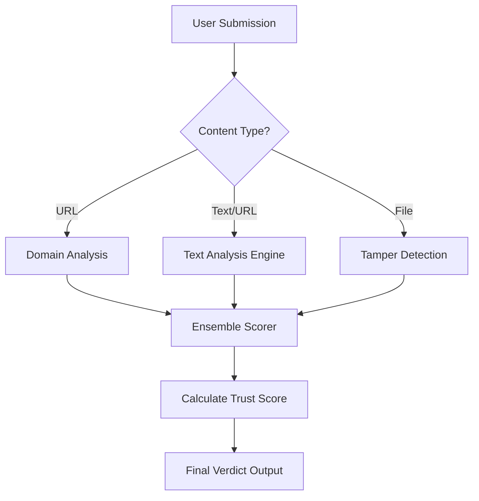
```mermaid
flowchart TD
    Start[User Submission] --> InputType{Content Type?}
    InputType -- URL --> DomainAnalysis[Domain Analysis]
    InputType -- Text/URL --> TextAnalysis[Text Analysis Engine]
    InputType -- File --> DocumentCheck[Tamper Detection]
    
    DomainAnalysis --> Ensemble[Ensemble Scorer]
    TextAnalysis --> Ensemble
    DocumentCheck --> Ensemble
    
    Ensemble --> Score[Calculate Trust Score]
    Score --> Verdict[Final Verdict Output]
```
The "Ensemble Scorer" uses predefined weights to balance the influence of different analysis modules. For example, text analysis currently holds the highest weight at 0.40.
Sources: [truelens-app/src/lib/analysis.ts:173-179](), [truelens-app/src/lib/analysis.ts:251-260]()

### Signal Weights
| Signal Type | Weight |
| :--- | :--- |
| Text Analysis | 0.40 |
| Domain Analysis | 0.25 |
| Image Analysis | 0.20 |
| Review Patterns | 0.10 |
| Provenance | 0.05 |

Sources: [truelens-app/src/lib/analysis.ts:174-180]()

## Data Structures and Types

The system uses a standardized set of interfaces to handle scans and document verifications. This ensures consistency across the API and UI components.

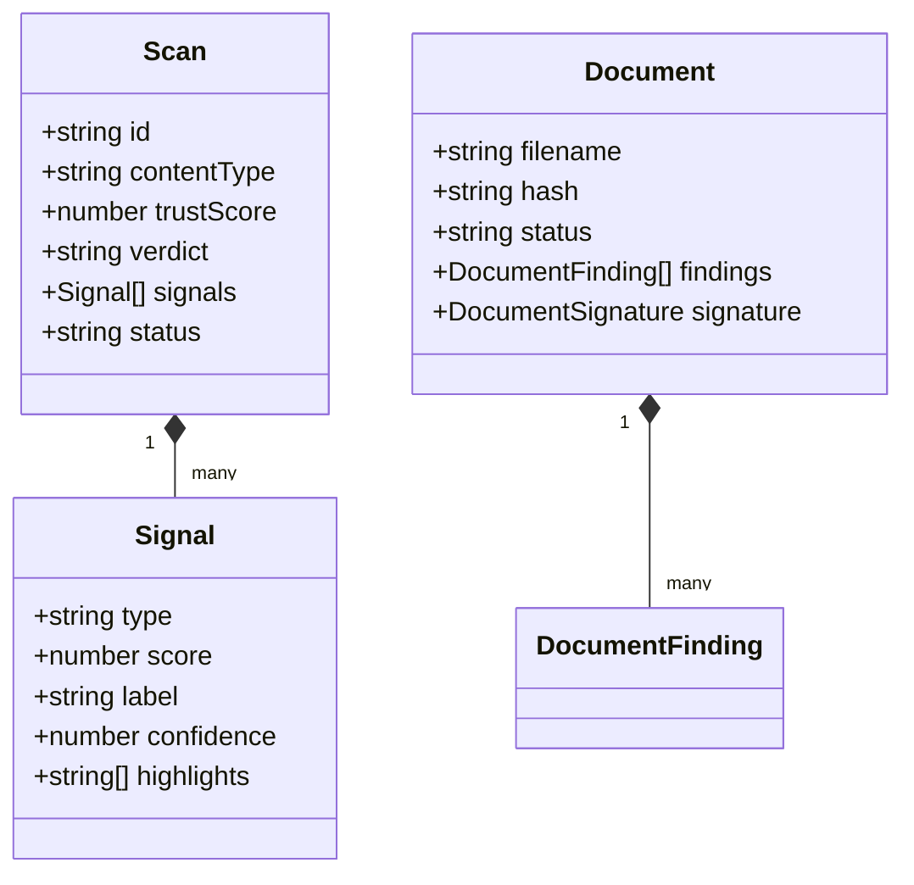
```mermaid
classDiagram
    class Scan {
        +string id
        +string contentType
        +number trustScore
        +string verdict
        +Signal[] signals
        +string status
    }
    class Signal {
        +string type
        +number score
        +string label
        +number confidence
        +string[] highlights
    }
    class Document {
        +string filename
        +string hash
        +string status
        +DocumentFinding[] findings
        +DocumentSignature signature
    }
    Scan "1" *-- "many" Signal
    Document "1" *-- "many" DocumentFinding
```
Sources: [truelens-app/src/lib/types.ts:16-56]()

## Integration and API

For developers, TrueLens provides a RESTful API. Integration follows a three-step process: obtaining an API key, submitting content via POST request, and retrieving the detailed signal breakdown.

### Example: Content Submission (cURL)
```bash
curl -X POST https://api.truelens.app/v1/scans \
  -H "Content-Type: application/json" \
  -H "Authorization: Bearer YOUR_API_KEY" \
  -d '{
    "url": "https://example.com/article",
    "contentType": "url"
  }'
```
Sources: [truelens-app/src/app/developers/page.tsx:63-70](), [truelens-app/src/app/developers/page.tsx:90-105]()

## Document Verification and Signing

A specific module is dedicated to document integrity. It identifies files (e.g., Aadhaar cards or invoices), performs arithmetic consistency checks, and checks for pixel-level manipulation. Verified documents are cryptographically signed with a SHA-256 hash to ensure they remain tamper-evident.

### Verification Flow
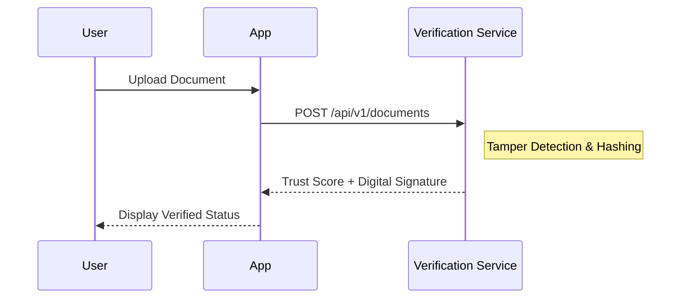
```mermaid
sequenceDiagram
    participant U as User
    participant A as App
    participant V as Verification Service
    U->>A: Upload Document
    A->>V: POST /api/v1/documents
    Note right of V: Tamper Detection & Hashing
    V-->>A: Trust Score + Digital Signature
    A-->>U: Display Verified Status
```
Sources: [truelens-app/src/app/documents/page.tsx:65-85](), [truelens-app/src/lib/analysis.ts:285-320]()

## Technical Stack

The project is structured as a Next.js application with a focus on high-performance animations and secure cryptographic operations.

*   **Framework:** Next.js 16.2.6 (React 19)
*   **Animations:** Framer Motion
*   **Icons:** Lucide React
*   **Security:** SHA-256 hashing via `crypto-js`
*   **Styling:** Tailwind CSS with custom glassmorphism components
*   **Package Management:** npm/yarn/pnpm

Sources: [truelens-app/package.json:10-35](), [truelens-app/src/app/globals.css:80-90]()

## Conclusion

TrueLens serves as a multi-layered defense against digital misinformation. By combining traditional domain verification with advanced text stylometry and document forensics, it provides a unified platform for establishing trust in the AI era. Whether used via the web dashboard or integrated through the public API, the platform aims to provide transparent, explainable authenticity verdicts.

### Local Development Setup

<details>
<summary>Relevant source files</summary>

The following files were used as context for generating this wiki page:

- [truelens-app/package.json](https://github.com/Priyanshu-2005/TrueLens/blob/main/truelens-app/package.json)
- [truelens-app/README.md](https://github.com/Priyanshu-2005/TrueLens/blob/main/truelens-app/README.md)
- [truelens-app/src/app/api/v1/scans/route.ts](https://github.com/Priyanshu-2005/TrueLens/blob/main/truelens-app/src/app/api/v1/scans/route.ts)
- [truelens-app/src/lib/analysis.ts](https://github.com/Priyanshu-2005/TrueLens/blob/main/truelens-app/src/lib/analysis.ts)
- [truelens-app/src/app/developers/page.tsx](https://github.com/Priyanshu-2005/TrueLens/blob/main/truelens-app/src/app/developers/page.tsx)
- [truelens-app/src/app/layout.tsx](https://github.com/Priyanshu-2005/TrueLens/blob/main/truelens-app/src/app/layout.tsx)
</details>

# Local Development Setup

The TrueLens project is a multi-tier AI-powered content verification platform. The local development environment consists of a Next.js frontend application (`truelens-app`) and a FastAPI backend service. The frontend serves as the user interface and API proxy, while the backend handles the intensive machine learning analysis for text, domains, and documents.

This guide details the steps required to configure the development environment, manage dependencies, and connect the frontend to the analysis services.

## Frontend Configuration (`truelens-app`)

The frontend is built using Next.js 16 and React 19. It uses Tailwind CSS for styling and Framer Motion for animations.

### Prerequisites and Installation
To set up the frontend, developers must install the dependencies defined in the package manifest. The project supports multiple package managers including npm, yarn, pnpm, and bun.

```bash
npm install
# or
yarn install
```
Sources: [truelens-app/package.json:1-42](), [truelens-app/README.md:3-15]()

### Development Server
The development server can be initiated using the `dev` script. By default, the application runs on `http://localhost:3000`.

```bash
npm run dev
```
Sources: [truelens-app/package.json:7](), [truelens-app/README.md:17-21]()

### Environment Variables
The frontend requires a connection to the FastAPI backend. This is configured via the `NEXT_PUBLIC_API_URL` environment variable. If not provided, it defaults to the local FastAPI instance.

| Variable | Description | Default Value |
| :--- | :--- | :--- |
| `NEXT_PUBLIC_API_URL` | The base URL for the Python analysis backend. | `http://127.0.0.1:8000` |

Sources: [truelens-app/src/app/api/v1/scans/route.ts:3]()

## Backend Integration and API Proxying

The Next.js application acts as a proxy for the backend services. Local development involves ensuring the Route Handlers can correctly communicate with the FastAPI endpoints.

### Request Flow
When a user initiates a scan (URL or Text), the request follows a specific path from the client to the analysis engine:

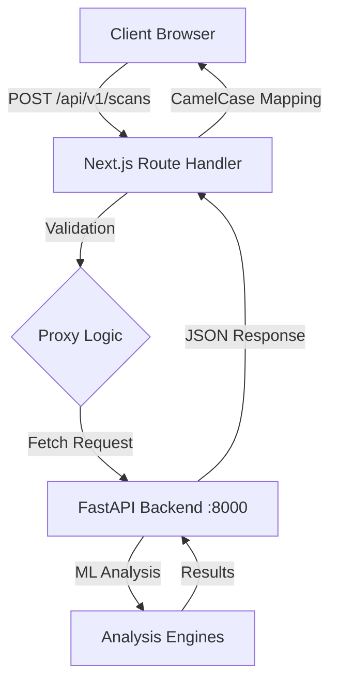
```mermaid
graph TD
    User[Client Browser] -->|POST /api/v1/scans| NextJS[Next.js Route Handler]
    NextJS -->|Validation| Proxy{Proxy Logic}
    Proxy -->|Fetch Request| FastAPI[FastAPI Backend :8000]
    FastAPI -->|ML Analysis| Engine[Analysis Engines]
    Engine -->|Results| FastAPI
    FastAPI -->|JSON Response| NextJS
    NextJS -->|CamelCase Mapping| User
```
The Next.js Route Handler performs initial validation, such as checking for minimum character counts (50 characters for text) before forwarding the request to the backend. It also maps snake_case responses from FastAPI to camelCase for frontend consumption.
Sources: [truelens-app/src/app/api/v1/scans/route.ts:6-66](), [truelens-app/src/app/developers/page.tsx:14-23]()

## Analysis Components and Mocking

During local development, certain features may use the internal `analysis.ts` library for simulation or prototype testing before connecting to the full ML pipeline.

### Internal Analysis Engines
The `src/lib/analysis.ts` file contains logic that can be used to simulate backend responses for:
*   **Stylometry Analysis**: Calculating average sentence length, burstiness, and vocabulary richness to detect AI signatures.
*   **Domain Reputation**: Checking TLDs and known trusted/suspicious domain lists.
*   **Document Integrity**: Simulating PDF tamper detection and SHA-256 hashing.

### Data Structures
The following structures are used across the application to represent analysis results:

| Feature | Key Data Fields | Source |
| :--- | :--- | :--- |
| **Scan Result** | `trustScore`, `verdict`, `signals`, `scanDuration` | [analysis.ts:167-175]() |
| **Document Result** | `hash`, `status`, `findings`, `signature` | [analysis.ts:257-260]() |
| **Text Features** | `burstiness`, `repetitionScore`, `uniqueWordRatio` | [analysis.ts:15-26]() |

Sources: [truelens-app/src/lib/analysis.ts:15-260]()

## Build and Deployment

For production-like local testing, the application can be built and started in production mode:

1.  **Build**: `npm run build` compiles the Next.js application and optimizes assets.
2.  **Start**: `npm run start` launches the production server.
3.  **Linting**: `npm run lint` executes ESLint to ensure code quality and adherence to project standards.

Sources: [truelens-app/package.json:8-10]()

## Summary
Local development of TrueLens requires a dual-service setup. The frontend handles the UI and request proxying via Next.js Route Handlers, while the backend (configured via `NEXT_PUBLIC_API_URL`) provides the machine learning capabilities. Developers can utilize the built-in analysis library for rapid prototyping of UI components and signal visualization without requiring the full ML stack for every change.


## System Architecture

### High-Level Architecture

<details>
<summary>Relevant source files</summary>

The following files were used as context for generating this wiki page:

- [truelens-app/src/lib/analysis.ts](https://github.com/Priyanshu-2005/TrueLens/blob/main/truelens-app/src/lib/analysis.ts)
- [truelens-app/src/lib/types.ts](https://github.com/Priyanshu-2005/TrueLens/blob/main/truelens-app/src/lib/types.ts)
- [truelens-app/src/app/developers/page.tsx](https://github.com/Priyanshu-2005/TrueLens/blob/main/truelens-app/src/app/developers/page.tsx)
- [truelens-app/src/app/scan/page.tsx](https://github.com/Priyanshu-2005/TrueLens/blob/main/truelens-app/src/app/scan/page.tsx)
- [truelens-app/src/app/documents/page.tsx](https://github.com/Priyanshu-2005/TrueLens/blob/main/truelens-app/src/app/documents/page.tsx)
- [truelens-app/src/app/verify/page.tsx](https://github.com/Priyanshu-2005/TrueLens/blob/main/truelens-app/src/app/verify/page.tsx)
- [truelens-app/src/app/page.tsx](https://github.com/Priyanshu-2005/TrueLens/blob/main/truelens-app/src/app/page.tsx)
- [truelens-app/package.json](https://github.com/Priyanshu-2005/TrueLens/blob/main/truelens-app/package.json)
</details>

# High-Level Architecture

TrueLens is an AI-powered content verification platform designed to detect AI-generated text, fraudulent documents, and suspicious domains. The architecture follows a modern web application structure using Next.js, integrating a multi-signal machine learning pipeline with cryptographic document signing. It provides both a user-facing dashboard for manual scans and a RESTful API for developer integration.

The system is centered around an ensemble scoring engine that aggregates various signals (stylometry, domain reputation, file integrity) into a unified "Trust Score." This score provides an explainable verdict on the authenticity of submitted content.

Sources: [truelens-app/src/app/page.tsx](), [truelens-app/src/lib/analysis.ts:241-260]()

## Core System Components

The architecture is divided into three primary functional layers: the Frontend Interface, the Analysis Engine, and the Developer API.

### 1. Analysis & Ensemble Engine
The core logic resides in `src/lib/analysis.ts`, which implements an ensemble scoring system. It processes different content types (URL, Text, or Documents) through specialized analysis functions.

*   **Text Analysis**: Uses stylometry to identify AI-generated patterns by calculating sentence length variance, burstiness, and vocabulary richness.
*   **Domain Analysis**: Evaluates URL credibility based on Top-Level Domains (TLDs), HTTPS status, and known trusted domain lists.
*   **Document Analysis**: Performs tamper detection on file uploads (PDF, DOCX, images) and validates arithmetic consistency or metadata integrity.
*   **Ensemble Scoring**: Combines individual signals using a weighted sum approach.

Sources: [truelens-app/src/lib/analysis.ts:1-240](), [truelens-app/src/lib/types.ts:11-20]()

### 2. Frontend Application
Built with Next.js 15, the frontend provides the primary user interface for interacting with the verification tools. Key modules include:
*   **Scan Interface**: A tabbed interface for URL and text submission.
*   **Document Portal**: A secure area for uploading sensitive files for tamper detection and viewing cryptographic hashes.
*   **Verification Page**: A public-facing tool to verify previously signed documents using their SHA-256 hash or Scan ID.

Sources: [truelens-app/src/app/scan/page.tsx](), [truelens-app/src/app/documents/page.tsx](), [truelens-app/src/app/verify/page.tsx]()

### 3. API & Developer Integration
TrueLens exposes its verification capabilities through a versioned REST API (`/api/v1/`). This allows external applications to programmatically submit scans and retrieve trust scores.

Sources: [truelens-app/src/app/developers/page.tsx:11-45]()

## Data Flow & Process Logic

The following diagram illustrates the lifecycle of a scan request, from user submission to the final trust verdict.

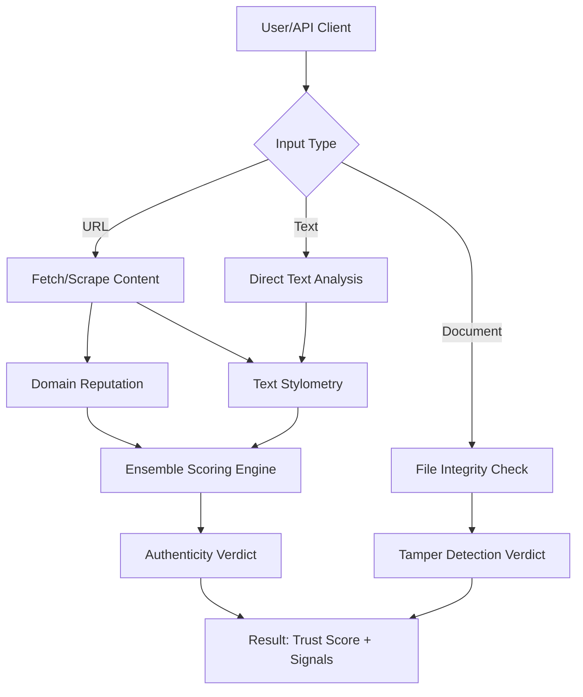
```mermaid
flowchart TD
    User[User/API Client] --> Input{Input Type}
    Input -- URL --> URLProc[Fetch/Scrape Content]
    Input -- Text --> TextProc[Direct Text Analysis]
    Input -- Document --> DocProc[File Integrity Check]
    
    URLProc --> DomainAnalysis[Domain Reputation]
    URLProc --> Stylometry[Text Stylometry]
    TextProc --> Stylometry
    
    DomainAnalysis --> Ensemble[Ensemble Scoring Engine]
    Stylometry --> Ensemble
    DocProc --> DocVerdict[Tamper Detection Verdict]
    
    Ensemble --> Verdict[Authenticity Verdict]
    Verdict --> Output[Result: Trust Score + Signals]
    DocVerdict --> Output
```
The flow demonstrates how TrueLens handles different content types through specialized processors before aggregating results.

Sources: [truelens-app/src/lib/analysis.ts:165-225](), [truelens-app/src/app/scan/page.tsx:32-65]()

## Component Specifications

### Analysis Signal Weights
The Ensemble engine applies specific weights to different signals to calculate the final Trust Score.

| Signal Type | Weight | Description |
| :--- | :--- | :--- |
| **Text** | 0.40 | Stylometry and AI pattern detection results. |
| **Domain** | 0.25 | Reputation, SSL, and TLD trustworthiness. |
| **Image** | 0.20 | Forensics and GAN fingerprinting (simulated in prototype). |
| **Review** | 0.10 | Behavioral pattern analysis for fraudulent reviews. |
| **Provenance** | 0.05 | Historical data from sources like Wayback Machine. |

Sources: [truelens-app/src/lib/analysis.ts:232-238]()

### Technical Stack
| Category | Technology |
| :--- | :--- |
| **Framework** | Next.js 15 (React 19) |
| **Styling** | Tailwind CSS 4, Framer Motion |
| **Utilities** | Lucide React, UUID, Crypto-JS |
| **Logic** | TypeScript |

Sources: [truelens-app/package.json]()

## Analysis Methodology

### Text Stylometry Features
The `extractTextFeatures` function calculates technical metrics to differentiate between human and AI-generated content.

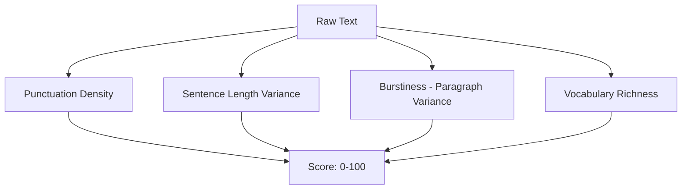
```mermaid
flowchart TD
    Text[Raw Text] --> Punct[Punctuation Density]
    Text --> Len[Sentence Length Variance]
    Text --> Burst[Burstiness - Paragraph Variance]
    Text --> Vocab[Vocabulary Richness]
    
    Punct & Len & Burst & Vocab --> AnalysisResult[Score: 0-100]
```
The analysis identifies "likely AI-generated" content when it detects low burstiness (uniform paragraph lengths) or very uniform sentence lengths.

Sources: [truelens-app/src/lib/analysis.ts:19-70](), [truelens-app/src/lib/analysis.ts:98-115]()

### Document Verification Sequence
The document verification process involves calculating hashes and checking for pixel-level or metadata manipulation.

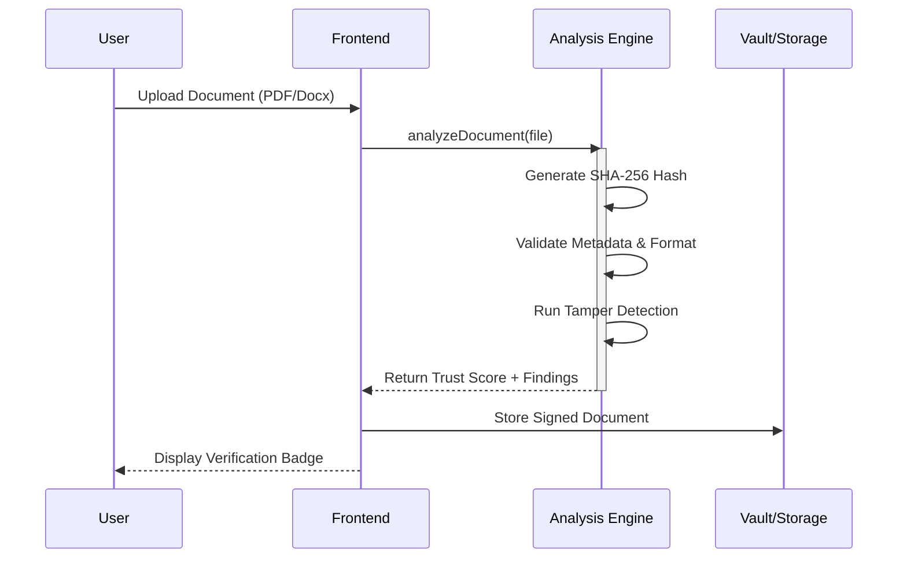
```mermaid
sequenceDiagram
    participant U as User
    participant F as Frontend
    participant A as Analysis Engine
    participant V as Vault/Storage
    
    U->>F: Upload Document (PDF/Docx)
    F->>A: analyzeDocument(file)
    activate A
    A->>A: Generate SHA-256 Hash
    A->>A: Validate Metadata & Format
    A->>A: Run Tamper Detection
    A-->>F: Return Trust Score + Findings
    deactivate A
    F->>V: Store Signed Document
    F-->>U: Display Verification Badge
```
Sources: [truelens-app/src/lib/analysis.ts:284-358](), [truelens-app/src/app/documents/page.tsx:47-75]()

## Conclusion
TrueLens architecture is centered on a flexible, signal-based evaluation of digital content. By utilizing an ensemble of stylometric analysis, domain reputation, and cryptographic document signing, it provides a comprehensive framework for trust in an AI-dominated environment. The system's design allows for future expansion into more complex ML models (like DistilBERT/RoBERTa) while maintaining a high-performance, user-friendly interface.

Sources: [truelens-app/src/lib/analysis.ts:5-8](), [truelens-app/src/app/page.tsx:230-245]()

### Frontend Architecture (Next.js)

<details>
<summary>Relevant source files</summary>

The following files were used as context for generating this wiki page:

- [truelens-app/src/app/layout.tsx](https://github.com/Priyanshu-2005/TrueLens/blob/main/truelens-app/src/app/layout.tsx)
- [truelens-app/src/app/page.tsx](https://github.com/Priyanshu-2005/TrueLens/blob/main/truelens-app/src/app/page.tsx)
- [truelens-app/src/app/scan/page.tsx](https://github.com/Priyanshu-2005/TrueLens/blob/main/truelens-app/src/app/scan/page.tsx)
- [truelens-app/src/app/api/v1/scans/route.ts](https://github.com/Priyanshu-2005/TrueLens/blob/main/truelens-app/src/app/api/v1/scans/route.ts)
- [truelens-app/src/lib/analysis.ts](https://github.com/Priyanshu-2005/TrueLens/blob/main/truelens-app/src/lib/analysis.ts)
- [truelens-app/package.json](https://github.com/Priyanshu-2005/TrueLens/blob/main/truelens-app/package.json)
- [truelens-app/src/app/globals.css](https://github.com/Priyanshu-2005/TrueLens/blob/main/truelens-app/src/app/globals.css)
- [truelens-app/src/app/developers/page.tsx](https://github.com/Priyanshu-2005/TrueLens/blob/main/truelens-app/src/app/developers/page.tsx)
- [truelens-app/src/components/Navbar.tsx](https://github.com/Priyanshu-2005/TrueLens/blob/main/truelens-app/src/components/Navbar.tsx)
</details>

# Frontend Architecture (Next.js)

The TrueLens frontend is built using **Next.js 16.2.6** and **React 19**, utilizing the App Router architecture to provide a high-performance, AI-powered content verification platform. The application serves as a comprehensive interface for detecting AI-generated text, manipulated images, and fraudulent documents through a multi-signal machine learning pipeline.

The architecture emphasizes modularity, utilizing client-side components for interactive analysis and server-side routes to proxy requests to a specialized FastAPI backend. It integrates sophisticated styling via Tailwind CSS and Framer Motion to deliver a "glassmorphism" design aesthetic while maintaining technical transparency through detailed signal breakdowns and trust scores.

Sources: [truelens-app/package.json:13-17](), [truelens-app/src/app/page.tsx:63-73](), [truelens-app/src/app/layout.tsx:10-18]()

## Core Framework and Project Structure

TrueLens adheres to the modern Next.js App Router convention, organizing features into logical route segments. The project uses TypeScript for type safety and includes a variety of specialized libraries for UI and utility functions.

### Directory Organization
*   **`src/app/`**: Contains the primary route segments, including `scan/`, `dashboard/`, `documents/`, and `developers/`.
*   **`src/components/`**: Houses reusable UI elements such as `Navbar`, `Footer`, and `TrustScoreGauge`.
*   **`src/lib/`**: Contains core logic, including the simulation-based `analysis.ts` engine and utility functions.
*   **`src/app/api/`**: Implements Route Handlers that serve as an internal API proxy.

Sources: [truelens-app/src/app/layout.tsx:4-5](), [truelens-app/src/components/Navbar.tsx:13-18](), [truelens-app/src/app/api/v1/scans/route.ts:1]()

### Tech Stack Summary

| Dependency | Version | Purpose |
| :--- | :--- | :--- |
| `next` | 16.2.6 | React framework for server rendering and routing |
| `react` | 19.2.4 | UI library |
| `framer-motion` | 12.38.0 | High-performance animations and transitions |
| `lucide-react` | 1.16.0 | Icon library |
| `tailwindcss` | 4.0.0+ | Utility-first CSS framework |
| `recharts` | 3.8.1 | Data visualization for scan results |
| `crypto-js` | 4.2.0 | Cryptographic utilities for document hashing |

Sources: [truelens-app/package.json:11-20]()

## Component Architecture and Layout

The application utilizes a `RootLayout` to maintain a consistent UI across all pages, wrapping children in a global `Navbar` and `Footer`.

### Global Layout and Styling
The `RootLayout` configures global metadata, including SEO keywords related to AI detection and content verification. It also loads global fonts (Inter and JetBrains Mono) and sets a dark-themed "primary" background.

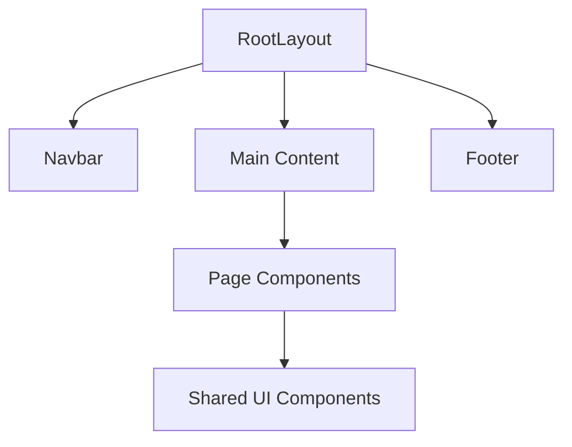
```mermaid
graph TD
    Layout[RootLayout] --> Nav[Navbar]
    Layout --> Main[Main Content]
    Layout --> Foot[Footer]
    Main --> Page[Page Components]
    Page --> UI[Shared UI Components]
```
The design system relies on CSS variables defined in `globals.css` to manage a consistent "TrueLens" brand identity, including specific tokens for "glass-card" effects and animated "gradient-mesh" backgrounds.

Sources: [truelens-app/src/app/layout.tsx:10-48](), [truelens-app/src/app/globals.css:4-30]()

## Data Flow and API Integration

TrueLens implements a proxy-based data flow where the Next.js frontend interacts with internal Route Handlers, which then communicate with a FastAPI backend.

### Scan Submission Flow
When a user submits content (URL or Text) for analysis, the application follows a specific sequence:
1.  **Client-side Validation**: Validates URL format or minimum text length (50 characters).
2.  **Internal API Call**: Sends a `POST` request to `/api/v1/scans`.
3.  **Backend Proxying**: The Route Handler forwards the request to the `BACKEND_URL` (FastAPI).
4.  **Data Transformation**: Snake_case keys from the backend are mapped to camelCase for React.
5.  **Navigation**: The user is redirected to the results page using the generated scan ID.

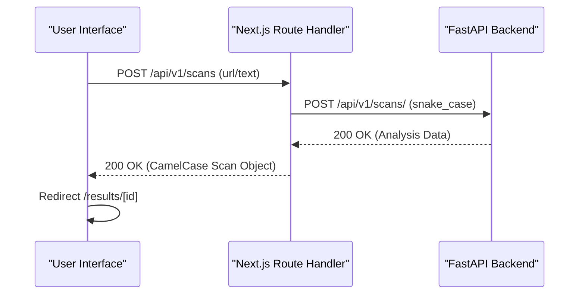
```mermaid
sequenceDiagram
    participant User as "User Interface"
    participant Route as "Next.js Route Handler"
    participant Fast as "FastAPI Backend"
    User->>Route: POST /api/v1/scans (url/text)
    Route->>Fast: POST /api/v1/scans/ (snake_case)
    Fast-->>Route: 200 OK (Analysis Data)
    Route-->>User: 200 OK (CamelCase Scan Object)
    User->>User: Redirect /results/[id]
```
Sources: [truelens-app/src/app/scan/page.tsx:28-60](), [truelens-app/src/app/api/v1/scans/route.ts:5-48]()

## Analysis Engine Logic

The frontend contains a client-side analysis engine in `src/lib/analysis.ts` used for prototyping and ensemble scoring. This engine calculates scores based on multiple "signals."

### Text Analysis Features
The `extractTextFeatures` function calculates stylometry metrics to distinguish human writing from AI.

| Metric | Calculation Basis | Significance |
| :--- | :--- | :--- |
| **Burstiness** | Variance in paragraph lengths | Human text typically has higher variance |
| **Vocabulary Richness** | Unique words / Total words | AI often uses more uniform, repetitive vocabulary |
| **Sentence Variance** | Std Dev of sentence lengths | Low variance suggests robotic, uniform structure |
| **Repetition Score** | Frequency of repeated words | High repetition is a common AI/spam signal |

Sources: [truelens-app/src/lib/analysis.ts:25-70]()

### Ensemble Scoring Logic
The final `trustScore` is a weighted average of available signals, adjusted by the confidence level of each model.

```typescript
const SIGNAL_WEIGHTS = {
  text: 0.40,
  domain: 0.25,
  image: 0.20,
  review: 0.10,
  provenance: 0.05,
};
```
Sources: [truelens-app/src/lib/analysis.ts:219-225](), [truelens-app/src/lib/analysis.ts:279-290]()

## Key Feature Modules

### 1. Content Scanner
Located at `/scan`, this module provides a tabbed interface for URL and Text analysis. It utilizes `AnimatePresence` for smooth transitions between input modes and provides example suggestions to guide users.
Sources: [truelens-app/src/app/scan/page.tsx:83-108]()

### 2. Document Verification
The `/documents` and `/verify` routes handle file uploads (PDF, PNG, JPG, DOCX) and cryptographic verification. Documents are analyzed for integrity and can be "signed" with SHA-256 hashes to prevent tampering.
Sources: [truelens-app/src/app/documents/page.tsx:106-130](), [truelens-app/src/app/verify/page.tsx:131-150]()

### 3. Developer Portal
The `/developers` page provides documentation for the REST API. It includes interactive code examples in cURL, Node.js, and Python, allowing developers to integrate TrueLens signals into external workflows.
Sources: [truelens-app/src/app/developers/page.tsx:43-70](), [truelens-app/src/app/developers/page.tsx:142-178]()

## Conclusion
The TrueLens frontend architecture leverages Next.js to create a responsive, secure, and visually cohesive experience for content verification. By combining client-side stylometry analysis with a robust backend proxy system, the application effectively balances immediate UI feedback with deep machine learning capabilities. The modular component structure ensures that as new AI detection signals (like image forensics or domain reputation) are added, the frontend can scale to present these insights clearly to the end-user.

### Backend Architecture (FastAPI)

<details>
<summary>Relevant source files</summary>

The following files were used as context for generating this wiki page:

- [truelens-backend/app/main.py](https://github.com/Priyanshu-2005/TrueLens/blob/main/truelens-backend/app/main.py)
- [truelens-app/src/app/api/v1/scans/route.ts](https://github.com/Priyanshu-2005/TrueLens/blob/main/truelens-app/src/app/api/v1/scans/route.ts)
- [truelens-app/src/app/api/v1/documents/route.ts](https://github.com/Priyanshu-2005/TrueLens/blob/main/truelens-app/src/app/api/v1/documents/route.ts)
- [truelens-app/src/lib/analysis.ts](https://github.com/Priyanshu-2005/TrueLens/blob/main/truelens-app/src/lib/analysis.ts)
- [truelens-app/src/app/developers/page.tsx](https://github.com/Priyanshu-2005/TrueLens/blob/main/truelens-app/src/app/developers/page.tsx)
- [truelens-app/src/lib/types.ts](https://github.com/Priyanshu-2005/TrueLens/blob/main/truelens-app/src/lib/types.ts)
</details>

# Backend Architecture (FastAPI)

## Introduction
The TrueLens backend is built using the FastAPI framework, serving as a high-performance, ML-powered Content Verification API. Its primary purpose is to orchestrate complex analysis pipelines for detecting AI-generated content, verifying document integrity, and performing domain trust assessments. The architecture is designed to handle multi-signal analysis including text stylometry, image forensics, and cryptographic signing.

The system operates as a decoupled architecture where a Next.js frontend proxies requests to the Python-based FastAPI service. This allows the backend to leverage specialized Python ML libraries (such as DistilBERT or RoBERTa) for deep content analysis while maintaining a responsive user interface.
Sources: [truelens-backend/app/main.py:10-15](), [truelens-app/src/app/api/v1/scans/route.ts:6-10]()

## Core Framework and Configuration
The backend is initialized in `main.py`, where the FastAPI application is configured with metadata and middleware. 

### Server Initialization
The application includes CORS (Cross-Origin Resource Sharing) middleware to allow communication with the Next.js frontend, specifically permitting requests from `http://localhost:3000`. It also automatically triggers database table creation using SQLAlchemy's `Base.metadata.create_all` upon startup.
Sources: [truelens-backend/app/main.py:6-31]()

### Key Components
| Component | Description |
| :--- | :--- |
| **FastAPI App** | The core ASGI application instance with title "TrueLens Backend". |
| **CORS Middleware** | Configured to allow all methods and headers for the frontend origin. |
| **API Router** | Centralized routing via `api_router` mounted under the `/api/v1` prefix. |
| **Database Engine** | Integrated with SQLAlchemy for persistence (invoked in `Base.metadata`). |

## API Layer and Endpoint Routing
The backend exposes several versioned RESTful endpoints for different verification workflows. While the Next.js application provides proxy routes, the actual business logic for ML analysis and database persistence resides in the Python backend.

```mermaid
flowchart TD
    Client[Client/Frontend] --> Proxy[Next.js API Route]
    Proxy --> FastAPI[FastAPI Backend]
    
    subgraph FastAPI_Endpoints [v1 Endpoints]
        direction TB
        E1[/api/v1/scans/]
        E2[/api/v1/documents/verify]
        E3[/api/v1/health]
    end
    
    FastAPI --> E1
    FastAPI --> E2
    FastAPI --> E3
    
    E1 --> ML[ML Analysis Engine]
    E2 --> Sig[Signing/Tamper Check]
```
This diagram illustrates the request flow from the client through the Next.js proxy to the FastAPI backend service.
Sources: [truelens-backend/app/main.py:31-33](), [truelens-app/src/app/api/v1/scans/route.ts:25-29](), [truelens-app/src/app/api/v1/documents/route.ts:18-22]()

### Endpoint Summary
| Method | Endpoint | Purpose |
| :--- | :--- | :--- |
| `GET` | `/api/v1/health` | Returns the system status as "healthy". |
| `POST` | `/api/v1/scans/` | Accepts URL or text for multi-signal ML analysis. |
| `GET` | `/api/v1/scans/` | Retrieves a list of all historical scan results. |
| `POST` | `/api/v1/documents/verify` | Processes file uploads for integrity checks and cryptographic signing. |
Sources: [truelens-backend/app/main.py:28-31](), [truelens-app/src/app/api/v1/scans/route.ts:25-50](), [truelens-app/src/app/developers/page.tsx:15-50]()

## Content Analysis Engine
The backend implements an ensemble scoring system that aggregates multiple "signals" to produce a final `trustScore`.

### Multi-Signal Pipeline
The analysis logic evaluates different content types through specialized modules:
1.  **Text Analysis**: Uses stylometry features such as sentence length variance, vocabulary richness, and "burstiness" to detect AI patterns.
2.  **Domain Analysis**: Checks TLD reputation, SSL status, and known trusted domain lists.
3.  **Provenance**: Analyzes the history of the content (e.g., via Google Cache or Wayback Machine).
4.  **Document Integrity**: Checks for pixel-level manipulation and arithmetic consistency in invoices.

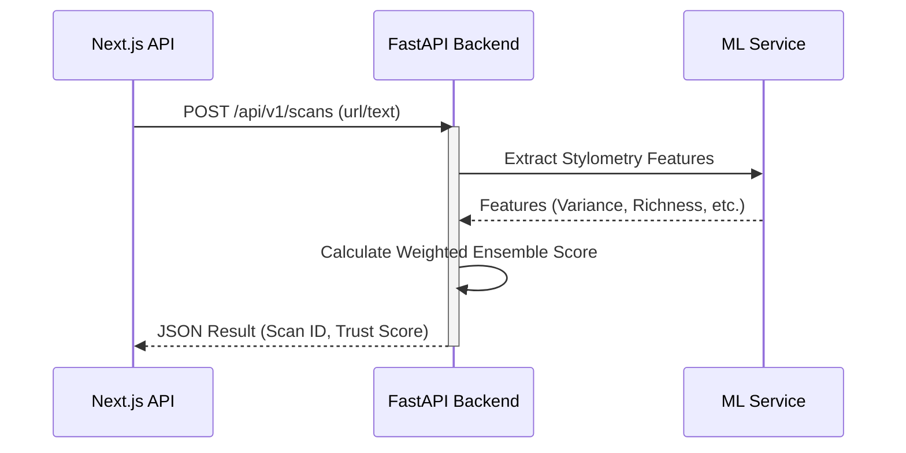
```mermaid
sequenceDiagram
    participant Proxy as Next.js API
    participant BE as FastAPI Backend
    participant ML as ML Service
    
    Proxy->>BE: POST /api/v1/scans (url/text)
    activate BE
    BE->>ML: Extract Stylometry Features
    ML-->>BE: Features (Variance, Richness, etc.)
    BE->>BE: Calculate Weighted Ensemble Score
    BE-->>Proxy: JSON Result (Scan ID, Trust Score)
    deactivate BE
```
The sequence shows how the backend processes a scan request by orchestrating feature extraction and ensemble scoring.
Sources: [truelens-app/src/lib/analysis.ts:180-260](), [truelens-app/src/lib/types.ts:11-20]()

### Data Models and Types
The backend utilizes specific data structures to represent the analysis results.

**Signal Structure:**
*   `type`: The category of analysis (e.g., "text", "domain").
*   `score`: A numerical value from 0-100.
*   `confidence`: The ML model's certainty in the result.
*   `evidence`: A dictionary of raw features (e.g., `avgSentenceLength`).
Sources: [truelens-app/src/lib/types.ts:11-20]()

**Scan Result:**
*   `trustScore`: The final aggregate score.
*   `verdict`: A string label (Authentic, Suspicious, or AI-Generated).
*   `scanDuration`: Processing time in seconds.
Sources: [truelens-app/src/lib/types.ts:22-36]()

## Document Verification and Signing
For file-based analysis, the backend performs "tamper detection" and provides cryptographic proof of verification.

### Cryptographic Signatures
When a document is verified, the backend generates a `DocumentSignature` object. This includes a SHA-256 hash of the document, a digital signature, and the public key used for verification. This ensures that the document cannot be altered after the TrueLens assessment.
Sources: [truelens-app/src/app/api/v1/documents/route.ts:35-45](), [truelens-app/src/lib/types.ts:55-62]()

### Verification Logic
The system supports verifying documents by their unique scan ID or their SHA-256 hash.
```python
# Conceptual verification check (mapped from developer portal)
{
  "verified": True,
  "message": "Document verified",
  "document": {
    "id": "doc_xyz789",
    "hash": "a3f2b8c9...",
    "status": "verified"
  }
}
```
Sources: [truelens-app/src/app/developers/page.tsx:35-40](), [truelens-app/src/app/verify/page.tsx:35-50]()

## Conclusion
The TrueLens Backend Architecture (FastAPI) provides a robust foundation for AI content detection and document verification. By combining a modern Python API with a weighted ensemble of ML signals, it offers a scalable solution for establishing digital trust. The integration of cryptographic signing further extends its utility into document provenance and tamper detection.


## Core Features

### Image & Media Analysis

<details>
<summary>Relevant source files</summary>

The following files were used as context for generating this wiki page:

- [truelens-backend/app/tasks/ml\_pipeline.py](https://github.com/Priyanshu-2005/TrueLens/blob/main/truelens-backend/app/tasks/ml_pipeline.py)
- [truelens-app/src/lib/analysis.ts](https://github.com/Priyanshu-2005/TrueLens/blob/main/truelens-app/src/lib/analysis.ts)
- [truelens-app/src/app/page.tsx](https://github.com/Priyanshu-2005/TrueLens/blob/main/truelens-app/src/app/page.tsx)
- [truelens-app/src/lib/types.ts](https://github.com/Priyanshu-2005/TrueLens/blob/main/truelens-app/src/lib/types.ts)
- [truelens-app/src/app/documents/page.tsx](https://github.com/Priyanshu-2005/TrueLens/blob/main/truelens-app/src/app/documents/page.tsx)
- [truelens-app/src/app/developers/page.tsx](https://github.com/Priyanshu-2005/TrueLens/blob/main/truelens-app/src/app/developers/page.tsx)
</details>

# Image & Media Analysis

The Image & Media Analysis system in TrueLens is designed to identify manipulated, AI-generated, or fraudulent visual content. It operates as part of a multi-signal pipeline that evaluates the authenticity of files and URLs by combining forensic techniques with machine learning heuristics. The system specifically targets GAN (Generative Adversarial Network) fingerprints, pixel-level inconsistencies, and metadata integrity.

Sources: [truelens-app/src/app/page.tsx:218-223](), [truelens-app/src/lib/analysis.ts:241-255]()

## System Architecture and Data Flow

The analysis process is triggered when a user submits a URL or uploads a document/image. The system bifurcates the processing logic between the frontend analysis engine (for immediate heuristics) and the backend ML pipeline (for asynchronous processing via Celery).

### Backend Pipeline
The backend utilizes a Celery-based task queue to process scans. When an image or document is analyzed, the `process_scan_task` manages the state of the scan, transitioning it from `pending` to `processing` and finally `completed` or `failed`. During this cycle, various signals are generated and stored in the database.

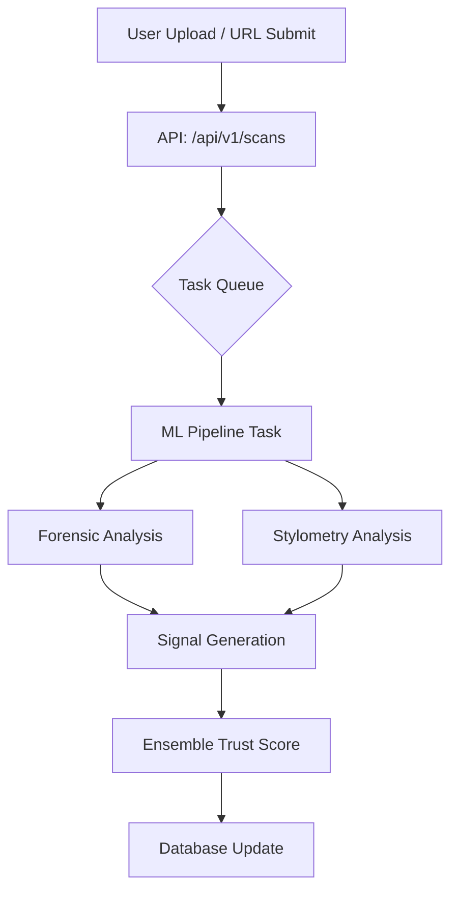
```mermaid
flowchart TD
    A[User Upload / URL Submit] --> B[API: /api/v1/scans]
    B --> C{Task Queue}
    C --> D[ML Pipeline Task]
    D --> E[Forensic Analysis]
    D --> F[Stylometry Analysis]
    E --> G[Signal Generation]
    F --> G
    G --> H[Ensemble Trust Score]
    H --> I[Database Update]
```
The diagram above shows the flow from user submission through the backend task queue and forensic analysis to the final trust score generation.
Sources: [truelens-backend/app/tasks/ml_pipeline.py:84-118](), [truelens-app/src/app/developers/page.tsx:14-25]()

## Forensic Analysis Components

TrueLens employs several forensic methods to detect media manipulation:

### Image Forensics Suite
*   **GAN Fingerprint Detection:** Identifies patterns specific to images generated by AI models.
*   **Error Level Analysis (ELA):** Detects inconsistencies in compression levels across an image, which often suggests pixel-level manipulation.
*   **EXIF Metadata Analysis:** Inspects the embedded metadata of a file to check for consistency with the claimed source and to detect usage of editing software.

Sources: [truelens-app/src/app/page.tsx:218-223](), [truelens-app/src/lib/analysis.ts:341-344]()

### Document Verification Logic
The system includes specialized logic for document types like PDF, PNG, and JPG. The `analyzeDocument` function performs the following checks:
*   **Format Validation:** Ensures files are well-formed and match their reported MIME type.
*   **Tamper Detection:** Scans for pixel-level inconsistencies and font-family variation (which indicates copy-paste or manipulation in documents).
*   **Arithmetic Consistency:** For invoices, the system validates that line items sum correctly to the total amount.
*   **Classification:** Identifies specific document types like Aadhaar cards or invoices to apply contextual rules.

Sources: [truelens-app/src/lib/analysis.ts:285-350](), [truelens-app/src/app/documents/page.tsx:218-245]()

## Data Structures and Signals

Analysis results are encapsulated in `Signal` and `Scan` objects. An image analysis result contributes to the `image` signal type within the ensemble.

### Key Types
| Interface | Field | Type | Description |
| :--- | :--- | :--- | :--- |
| `Signal` | `type` | `"image" \| "text" \| "metadata" ...` | The category of analysis performed. |
| `Signal` | `score` | `number` | The authenticity score (0-100). |
| `Scan` | `trustScore` | `number` | The final aggregated score from all signals. |
| `Document` | `hash` | `string` | SHA-256 hash for integrity verification. |
| `Document` | `signature` | `DocumentSignature` | Cryptographic signature for verified files. |

Sources: [truelens-app/src/lib/types.ts:13-68]()

## Ensemble Scoring Logic

The final verdict for a media scan is determined by weighting different signals. The "image" signal is a significant component of the overall trust calculation.

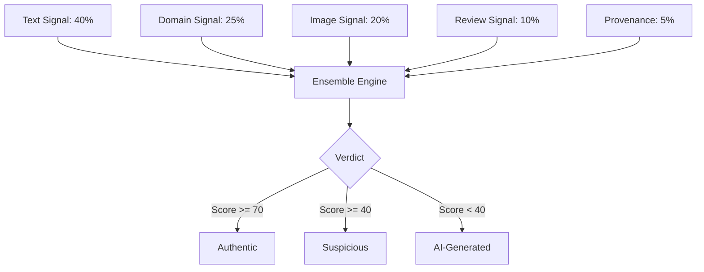
```mermaid
graph TD
    S1[Text Signal: 40%] --> E[Ensemble Engine]
    S2[Domain Signal: 25%] --> E
    S3[Image Signal: 20%] --> E
    S4[Review Signal: 10%] --> E
    S5[Provenance: 5%] --> E
    E --> V{Verdict}
    V -->|Score >= 70| Auth[Authentic]
    V -->|Score >= 40| Susp[Suspicious]
    V -->|Score < 40| AI[AI-Generated]
```
The diagram represents the weighted distribution used to calculate the final authenticity verdict.
Sources: [truelens-app/src/lib/analysis.ts:241-255](), [truelens-app/src/lib/analysis.ts:273-281]()

## API Implementation

Developers can access the analysis engine through specific REST endpoints.

| Method | Endpoint | Description |
| :--- | :--- | :--- |
| `POST` | `/api/v1/scans` | Submits a URL for content and image analysis. |
| `POST` | `/api/v1/documents` | Uploads a file for forensic verification. |
| `POST` | `/api/v1/verify` | Verifies a document by its SHA-256 hash or Scan ID. |

Sources: [truelens-app/src/app/developers/page.tsx:14-45]()

### Document Verification Example
```typescript
// From truelens-app/src/app/documents/page.tsx
const handleUpload = async (file: File) => {
  const formData = new FormData();
  formData.append("file", file);

  const res = await fetch("/api/v1/documents", {
    method: "POST",
    body: formData,
  });
  // Returns trustScore and forensic findings
}
```
Sources: [truelens-app/src/app/documents/page.tsx:43-65]()

## Conclusion
The Image & Media Analysis module provides a robust framework for detecting digital forgeries. By combining low-level pixel analysis (ELA) with high-level AI fingerprinting and cryptographic signing, TrueLens ensures that visual content remains verifiable in an environment increasingly dominated by generative AI.

### Domain Analysis

<details>
<summary>Relevant source files</summary>

The following files were used as context for generating this wiki page:

- [truelens-app/src/lib/analysis.ts](https://github.com/Priyanshu-2005/TrueLens/blob/main/truelens-app/src/lib/analysis.ts)
- [truelens-backend/app/tasks/ml_pipeline.py](https://github.com/Priyanshu-2005/TrueLens/blob/main/truelens-backend/app/tasks/ml_pipeline.py)
- [truelens-app/src/lib/types.ts](https://github.com/Priyanshu-2005/TrueLens/blob/main/truelens-app/src/lib/types.ts)
- [truelens-app/src/app/scan/page.tsx](https://github.com/Priyanshu-2005/TrueLens/blob/main/truelens-app/src/app/scan/page.tsx)
- [truelens-app/src/app/developers/page.tsx](https://github.com/Priyanshu-2005/TrueLens/blob/main/truelens-app/src/app/developers/page.tsx)
- [truelens-backend/app/services/domain_analysis.py](https://github.com/Priyanshu-2005/TrueLens/blob/main/truelens-backend/app/services/domain_analysis.py)
</details>

# Domain Analysis

Domain Analysis is a core component of the TrueLens content verification platform, designed to assess the credibility and trustworthiness of web-based content by evaluating its source URL. It operates as a critical signal within the ensemble scoring engine, focusing on technical metadata, registration patterns, and historical reputation of web domains.

This module helps distinguish between established, high-reputation sources (such as mainstream news or educational institutions) and potentially malicious or low-trust entities (such as phishing sites, temporary "burner" domains, or sites with suspicious structural patterns). Domain Analysis is automatically triggered whenever a user submits a URL for scanning.

Sources: [truelens-app/src/lib/analysis.ts:147-151](), [truelens-app/src/app/page.tsx:291-295]()

## Scoring Logic and Heuristics

The domain analysis engine utilizes a heuristic-based scoring system that starts at a neutral base score of 50 and adjusts based on various technical criteria.

### TLD and Reputation Checks
The system maintains lists of Top-Level Domains (TLDs) and specific hostnames to adjust trust levels:
*   **Trusted TLDs**: Extensions like `.com`, `.org`, `.edu`, `.gov`, and `.net` provide a positive score boost (+10).
*   **Suspicious TLDs**: Domains ending in `.xyz`, `.top`, `.click`, `.buzz`, `.ml`, or `.tk` are penalized (-20) as they are frequently associated with spam or low-quality automated content.
*   **Known Trusted Domains**: Specific high-authority domains (e.g., `google.com`, `bbc.com`, `nature.com`, `arxiv.org`) receive a significant trust boost (+25).

Sources: [truelens-app/src/lib/analysis.ts:157-178]()

### Structural and Security Analysis
The engine analyzes the URL's structure and protocol for red flags:
*   **HTTPS Protocol**: Valid encryption provides a minor boost (+5), while the absence of HTTPS results in a significant penalty (-15).
*   **Domain Patterns**: The presence of four or more consecutive numbers (-10) or excessive hyphens (more than three) (-10) indicates potentially auto-generated or suspicious domain names.
*   **Subdomain Depth**: Deeply nested subdomains (more than two levels deep) are penalized (-8) as they are common in phishing schemes.

Sources: [truelens-app/src/lib/analysis.ts:180-201]()

## Integration within ML Pipeline

In the backend architecture, domain analysis is integrated into the asynchronous Celery task pipeline. When a URL is submitted, the `process_scan_task` invokes the domain analysis service alongside text stylometry analysis.

The following sequence diagram illustrates how a URL scan request moves from the user interface through the backend analysis services.

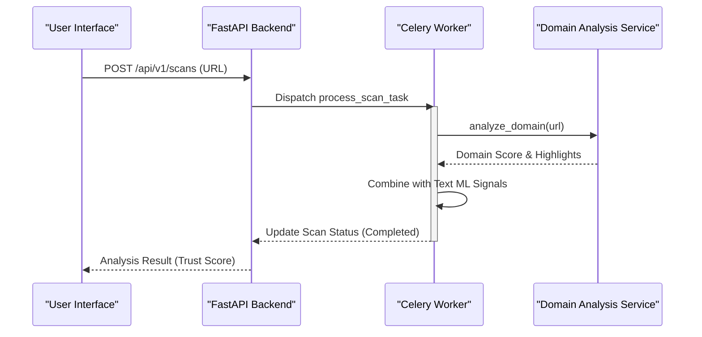
```mermaid
sequenceDiagram
    participant User as "User Interface"
    participant API as "FastAPI Backend"
    participant Celery as "Celery Worker"
    participant DomainSvc as "Domain Analysis Service"

    User->>API: POST /api/v1/scans (URL)
    API->>Celery: Dispatch process_scan_task
    activate Celery
    Celery->>DomainSvc: analyze_domain(url)
    DomainSvc-->>Celery: Domain Score & Highlights
    Celery->>Celery: Combine with Text ML Signals
    Celery-->>API: Update Scan Status (Completed)
    deactivate Celery
    API-->>User: Analysis Result (Trust Score)
```
This diagram shows the flow of a URL scan request through the system components.

Sources: [truelens-backend/app/tasks/ml_pipeline.py:73-82](), [truelens-app/src/app/scan/page.tsx:49-65]()

## Analysis Signals and Verdicts

The output of the domain analysis is encapsulated in an `AnalysisResult` object, which includes a score (0-100), a categorical label, and a confidence level.

| Score Range | Label | Significance |
| :--- | :--- | :--- |
| 70 - 100 | Established Domain | Highly reputable or long-standing domain. |
| 40 - 69 | Unverified Domain | Domain has mixed signals or lack of established history. |
| 0 - 39 | Suspicious Domain | High probability of being a malicious or low-quality source. |

Sources: [truelens-app/src/lib/analysis.ts:205-212](), [truelens-app/src/lib/types.ts:74-80]()

### Data Structure: Domain Signal
When stored, the domain analysis contributes a `Signal` object to the scan result.

```typescript
// Example Domain Signal structure
{
  type: "domain",
  score: 85,
  label: "Established Domain",
  confidence: 0.9,
  evidence: {
    domain: "nature.com",
    protocol: "https:",
    sslValid: true,
    subdomains: 0
  },
  highlights: ["Known trusted domain"]
}
```
Sources: [truelens-app/src/lib/types.ts:10-19](), [truelens-app/src/lib/analysis.ts:214-222]()

## API Implementation

Developers can access domain analysis by submitting a URL to the scan endpoint. The system identifies the content type as `url` and routes it through the domain evaluation logic.

*   **Endpoint**: `POST /api/v1/scans`
*   **Payload**: `{ "url": "string", "contentType": "url" }`
*   **Response**: Includes a `trustScore` and a list of `signals` where one signal type is `domain`.

Sources: [truelens-app/src/app/developers/page.tsx:14-23](), [truelens-app/src/lib/analysis.ts:229-231]()

## Conclusion
Domain Analysis provides a foundational layer of trust verification for the TrueLens platform. By combining static heuristic checks on TLDs and protocols with reputation-based lists, it effectively identifies the structural legitimacy of content sources before deeper ML-based content analysis is performed.

Sources: [truelens-app/src/lib/analysis.ts:285-290]()

### Document Signing & Verification

<details>
<summary>Relevant source files</summary>

The following files were used as context for generating this wiki page:

- [truelens-backend/app/api/v1/endpoints/documents.py](https://github.com/Priyanshu-2005/TrueLens/blob/main/truelens-backend/app/api/v1/endpoints/documents.py)
- [truelens-app/src/app/verify/page.tsx](https://github.com/Priyanshu-2005/TrueLens/blob/main/truelens-app/src/app/verify/page.tsx)
- [truelens-app/src/app/documents/page.tsx](https://github.com/Priyanshu-2005/TrueLens/blob/main/truelens-app/src/app/documents/page.tsx)
- [truelens-app/src/app/api/v1/verify/route.ts](https://github.com/Priyanshu-2005/TrueLens/blob/main/truelens-app/src/app/api/v1/verify/route.ts)
- [truelens-app/src/lib/types.ts](https://github.com/Priyanshu-2005/TrueLens/blob/main/truelens-app/src/lib/types.ts)
- [truelens-app/src/lib/analysis.ts](https://github.com/Priyanshu-2005/TrueLens/blob/main/truelens-app/src/lib/analysis.ts)
- [truelens-app/src/lib/store.ts](https://github.com/Priyanshu-2005/TrueLens/blob/main/truelens-app/src/lib/store.ts)
</details>

# Document Signing & Verification

The **Document Signing & Verification** module is a core component of the TrueLens platform designed to ensure the integrity and authenticity of digital files. It provides a multi-layered approach consisting of heuristic document analysis, tamper detection, and cryptographic signing. By generating a unique SHA-256 hash for every document and applying an ECDSA digital signature, the system creates a verifiable "truth" for files such as invoices, identification cards (e.g., Aadhaar), and legal contracts.

This system serves two primary roles: first, it analyzes uploaded documents for signs of manipulation or malicious content; second, it provides a public verification interface where users can confirm if a document's hash matches a previously signed and verified record in the TrueLens ledger.

## Document Upload and Analysis Pipeline

The document processing workflow begins when a user uploads a file through the frontend interface. The system immediately initiates a series of checks to determine the "Trust Score" and security status of the document.

### Processing Logic
1.  **Hashing:** The backend generates a SHA-256 hash of the raw file contents to serve as a unique identifier.
2.  **Security Filtering:** Files are checked against a blocklist of dangerous extensions (e.g., `.exe`, `.sh`, `.bat`). If detected, the document is automatically "flagged" and assigned a low trust score.
3.  **Heuristic Analysis:** The `analyzeDocument` engine performs specific checks based on the file type:
    *   **PDF/Images:** Checks for metadata integrity, font consistency (to detect copy-pasting), and pixel-level manipulation.
    *   **Content Classification:** Identifies specific document types like "Aadhaar" or "Invoice" and performs specialized logic (e.g., QR code structure validation or arithmetic consistency in invoices).

Sources: [truelens-backend/app/api/v1/endpoints/documents.py:14-41](), [truelens-app/src/lib/analysis.ts:240-318]()

### Document Signing Sequence
If a document passes the trust threshold (status "verified"), the backend generates a digital signature. This process links the document's hash to a timestamp and a public key, ensuring that any subsequent modification to the file would result in a hash mismatch during future verification.

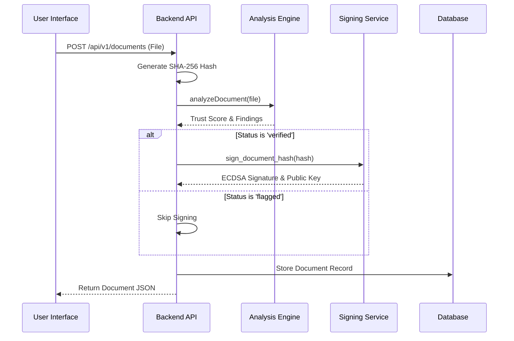
```mermaid
sequenceDiagram
    participant U as User Interface
    participant B as Backend API
    participant A as Analysis Engine
    participant S as Signing Service
    participant DB as Database

    U->>B: POST /api/v1/documents (File)
    B->>B: Generate SHA-256 Hash
    B->>A: analyzeDocument(file)
    A-->>B: Trust Score & Findings
    alt Status is 'verified'
        B->>S: sign_document_hash(hash)
        S-->>B: ECDSA Signature & Public Key
    else Status is 'flagged'
        B->>B: Skip Signing
    end
    B->>DB: Store Document Record
    B-->>U: Return Document JSON
```
The diagram shows the transition from raw file upload to the generation of a cryptographic signature based on analysis results.
Sources: [truelens-backend/app/api/v1/endpoints/documents.py:43-68](), [truelens-app/src/app/documents/page.tsx:43-68]()

## Verification System

The verification system allows third parties to validate the authenticity of a document using either its unique **SHA-256 Hash** or a **Scan ID**.

### Verification Logic
When a request is sent to the `/api/v1/verify` endpoint, the system performs a lookup in the `dataStore`. A document is considered "Verified" only if:
1.  A record matching the hash or scan ID exists.
2.  The record contains a valid cryptographic signature.
3.  The status is explicitly set to `verified`.

If the document was previously flagged for tampering (e.g., suspicious font changes or metadata inconsistencies), the verification fails and returns a warning message to the user.

Sources: [truelens-app/src/app/api/v1/verify/route.ts:6-56](), [truelens-app/src/app/verify/page.tsx:34-53]()

### Verification Status Flow
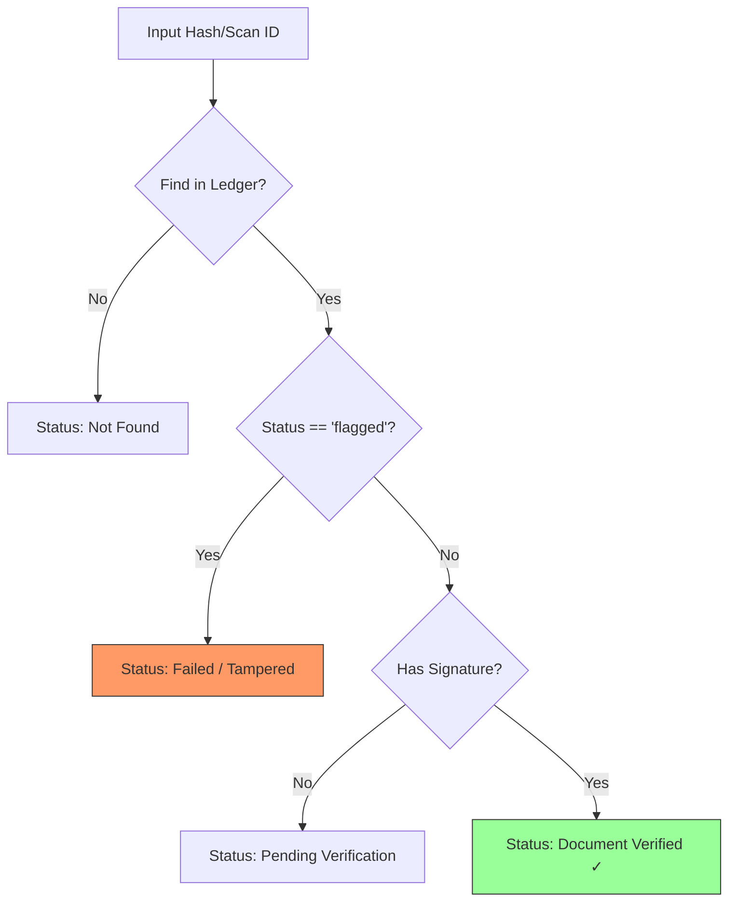
```mermaid
flowchart TD
    Start[Input Hash/Scan ID] --> Lookup{Find in Ledger?}
    Lookup -- No --> NotFound[Status: Not Found]
    Lookup -- Yes --> FlaggedCheck{Status == 'flagged'?}
    FlaggedCheck -- Yes --> Tampered[Status: Failed / Tampered]
    FlaggedCheck -- No --> SignatureCheck{Has Signature?}
    SignatureCheck -- No --> Pending[Status: Pending Verification]
    SignatureCheck -- Yes --> Success[Status: Document Verified ✓]
    
    style Tampered fill:#f96,stroke:#333
    style Success fill:#9f9,stroke:#333
```
This flowchart describes the conditional logic used by the verification route to determine the authenticity of a document.
Sources: [truelens-app/src/app/api/v1/verify/route.ts:25-52]()

## Data Models

The following data structures define how documents and their associated cryptographic signatures are represented within the system.

### Document Interface
| Field | Type | Description |
| :--- | :--- | :--- |
| `id` | `string` | Unique identifier (e.g., `doc_xxx`). |
| `filename` | `string` | Name of the uploaded file. |
| `hash` | `string` | SHA-256 checksum of the file content. |
| `status` | `string` | Current state: `pending`, `analyzing`, `verified`, or `flagged`. |
| `trustScore`| `number` | Calculated score (0-100) based on analysis. |
| `signature` | `Object` | Cryptographic signature data (if verified). |

Sources: [truelens-app/src/lib/types.ts:39-51]()

### Document Signature Structure
| Field | Type | Description |
| :--- | :--- | :--- |
| `documentHash`| `string` | The hash that was signed. |
| `signature` | `string` | The base64 encoded ECDSA signature. |
| `timestamp` | `string` | ISO 8601 string of when the signature was issued. |
| `publicKey` | `string` | The public key used for verification. |

Sources: [truelens-app/src/lib/types.ts:60-67]()

## API Endpoints

### Document Management
| Method | Endpoint | Description |
| :--- | :--- | :--- |
| `POST` | `/api/v1/documents` | Uploads a file, performs analysis, and signs it. |
| `GET` | `/api/v1/documents/:hash` | Retrieves the status of a document via its hash. |
| `POST` | `/api/v1/verify` | Validates a document hash or scan ID against the ledger. |

Sources: [truelens-backend/app/api/v1/endpoints/documents.py:14](), [truelens-app/src/app/developers/page.tsx:28-44]()

### Request Examples
**Verify Document (POST):**
```json
{
  "hash": "a3f2b8c9d1e4f5a6b7c8d9e0f1a2b3c4d5e6f7a8b9c0d1e2f3a4b5c6d7e8f9"
}
```
Sources: [truelens-app/src/app/developers/page.tsx:40-42]()

## Implementation Details

### Document Analysis Findings
The analysis engine populates an array of `findings` during processing. These findings are used to justify the final Trust Score and status.
*   **High Severity:** "Executable files are not permitted", "Pixel-level manipulation detected".
*   **Medium Severity:** "Multiple font families detected", "Large file size may indicate high-res embedded images".
*   **Low Severity:** "QR code structure validation passed", "Metadata is consistent".

Sources: [truelens-app/src/lib/analysis.ts:251-314](), [truelens-backend/app/api/v1/endpoints/documents.py:38-41]()

### Data Persistence
While the production environment uses PostgreSQL via SQLAlchemy, the prototype utilizes an in-memory `DataStore` to maintain records. This store is seeded with demo documents (e.g., `contract_2024.pdf`) to facilitate testing of the verification page.

Sources: [truelens-app/src/lib/store.ts:8-132]()

The Document Signing & Verification system provides a robust framework for digital content integrity. By combining automated forensic analysis with cryptographic proof, it ensures that once a document is deemed "Authentic" by TrueLens, its state is permanently recorded and easily verifiable by any entity with access to the document's hash.

### Trust Score Calculation

<details>
<summary>Relevant source files</summary>

The following files were used as context for generating this wiki page:

- [truelens-app/src/lib/analysis.ts](https://github.com/Priyanshu-2005/TrueLens/blob/main/truelens-app/src/lib/analysis.ts)
- [truelens-app/src/components/TrustScoreGauge.tsx](https://github.com/Priyanshu-2005/TrueLens/blob/main/truelens-app/src/components/TrustScoreGauge.tsx)
- [truelens-app/src/lib/types.ts](https://github.com/Priyanshu-2005/TrueLens/blob/main/truelens-app/src/lib/types.ts)
- [truelens-app/src/lib/utils.ts](https://github.com/Priyanshu-2005/TrueLens/blob/main/truelens-app/src/lib/utils.ts)
- [truelens-app/src/app/developers/page.tsx](https://github.com/Priyanshu-2005/TrueLens/blob/main/truelens-app/src/app/developers/page.tsx)
- [truelens-app/src/app/results/[id]/page.tsx](https://github.com/Priyanshu-2005/TrueLens/blob/main/truelens-app/src/app/results/%5Bid%5D/page.tsx)

</details>

# Trust Score Calculation

The Trust Score Calculation system in TrueLens is a multi-dimensional analysis engine designed to evaluate the authenticity of digital content. It aggregates signals from various sources—including text stylometry, domain reputation, and document integrity—to produce a consolidated numerical score ranging from 0 to 100. This score represents the likelihood that the analyzed content is authentic and human-generated rather than AI-generated or fraudulent.

The system employs an ensemble scoring approach where individual signals are weighted based on their reliability and combined to form a final verdict. This allows the platform to provide granular insights into why specific content is flagged as suspicious or verified as authentic.

Sources: [truelens-app/src/lib/analysis.ts](), [truelens-app/src/lib/types.ts]()

## Architecture and Data Flow

The analysis process follows a pipeline where raw input (URL or text) is decomposed into specific features, analyzed by specialized sub-modules, and then aggregated by an ensemble engine.

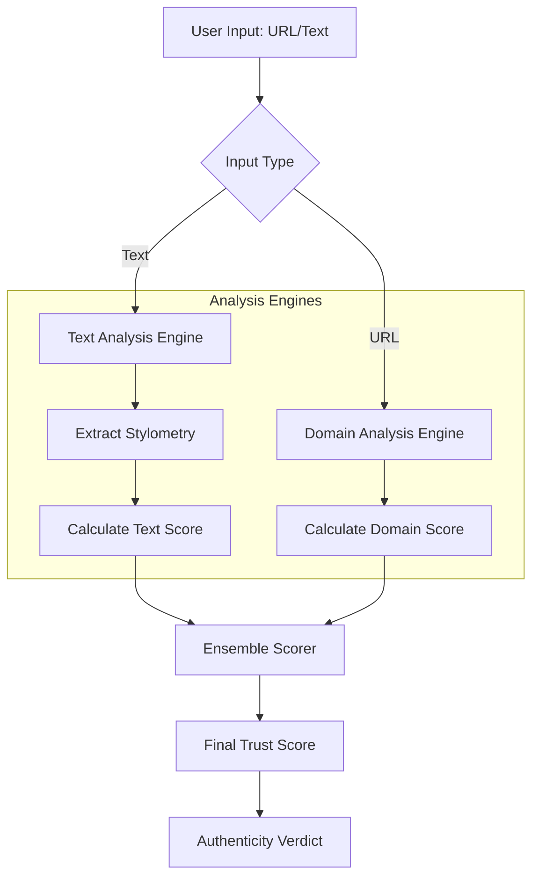
```mermaid
flowchart TD
    Input[User Input: URL/Text] --> Dispatcher{Input Type}
    Dispatcher -->|Text| TextAnalysis[Text Analysis Engine]
    Dispatcher -->|URL| DomainAnalysis[Domain Analysis Engine]
    
    subgraph Analysis_Engines [Analysis Engines]
        TextAnalysis --> TextFeatures[Extract Stylometry]
        TextFeatures --> TextScoring[Calculate Text Score]
        DomainAnalysis --> DomainScoring[Calculate Domain Score]
    end
    
    TextScoring --> Ensemble[Ensemble Scorer]
    DomainScoring --> Ensemble
    
    Ensemble --> FinalScore[Final Trust Score]
    FinalScore --> Verdict[Authenticity Verdict]
```
The diagram above illustrates the logical flow from user input to the final authenticity verdict.
Sources: [truelens-app/src/lib/analysis.ts:184-250]()

## Analysis Modules

### Text Analysis Engine
The text analysis engine focuses on stylometry—the study of linguistic style. It extracts quantitative features from text to distinguish between human and AI-generated patterns.

Key features extracted include:
*   **Vocabulary Richness:** Ratio of unique words to total words. AI often uses more uniform vocabulary.
*   **Burstiness:** Variation in paragraph and sentence structures. Human writing typically exhibits higher structural variance.
*   **Sentence Length Variance:** Uniform sentence lengths often trigger AI-generated signals.
*   **Repetition Score:** Frequency of repeated words or phrases.

Sources: [truelens-app/src/lib/analysis.ts:14-87]()

### Domain Analysis Engine
For URL-based scans, the system evaluates the credibility of the hosting domain using several heuristic checks.

| Feature | Logic | Impact |
| :--- | :--- | :--- |
| TLD Check | Suspicious TLDs (.xyz, .click, .top) vs Trusted (.com, .gov, .edu) | -20 to +10 |
| Trusted Domains | Matches against a whitelist (e.g., reuters.com, nature.com) | +25 |
| HTTPS Check | Presence of SSL/TLS encryption | +5 or -15 |
| Subdomain Depth | Number of nesting levels in the hostname | -8 for deep nesting |

Sources: [truelens-app/src/lib/analysis.ts:133-181]()

## Scoring Logic and Ensemble Calculation

### Ensemble Weights
The final Trust Score is a weighted average of available signals. Different signal types contribute differently to the final result based on the `SIGNAL_WEIGHTS` configuration.

```typescript
const SIGNAL_WEIGHTS = {
  text: 0.40,
  domain: 0.25,
  image: 0.20,
  review: 0.10,
  provenance: 0.05,
};
```
Sources: [truelens-app/src/lib/analysis.ts:184-190]()

### Calculation Formula
The system calculates a `weightedSum` and a `weightSum` adjusted by the confidence level of each individual signal. This ensures that low-confidence signals have less impact on the final score.

1.  For each signal: `confidenceAdjusted = signal.score * signal.confidence`
2.  `weightedSum += confidenceAdjusted * weight`
3.  `weightSum += weight * signal.confidence`
4.  `trustScore = weightedSum / weightSum` (rounded)

Sources: [truelens-app/src/lib/analysis.ts:245-257]()

## Verdict Classification

Scores are categorized into three primary levels of authenticity, which are used across the UI for badges and gauges.

| Score Range | Label | CSS Class |
| :--- | :--- | :--- |
| 70 - 100 | Likely Human-Written / Authentic | `badge-success` |
| 40 - 69 | Mixed Signals / Suspicious | `badge-warning` |
| 0 - 39 | Likely AI-Generated / Flagged | `badge-danger` |

Sources: [truelens-app/src/lib/utils.ts:10-23](), [truelens-app/src/components/TrustScoreGauge.tsx:21-30]()

## Document Integrity Analysis

In addition to text and URL analysis, the system performs specialized checks for uploaded documents. This involves format validation, tamper detection, and metadata integrity checks.

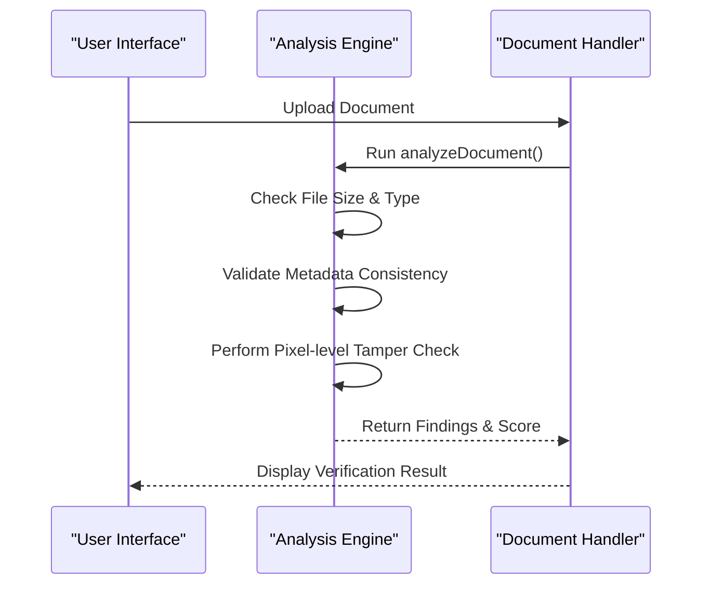
```mermaid
sequenceDiagram
    participant User as "User Interface"
    participant Engine as "Analysis Engine"
    participant Doc as "Document Handler"
    
    User->>Doc: Upload Document
    Doc->>Engine: Run analyzeDocument()
    Engine->>Engine: Check File Size & Type
    Engine->>Engine: Validate Metadata Consistency
    Engine->>Engine: Perform Pixel-level Tamper Check
    Engine-->>Doc: Return Findings & Score
    Doc-->>User: Display Verification Result
```
The sequence diagram shows the document verification flow, including metadata and tamper detection steps.
Sources: [truelens-app/src/lib/analysis.ts:271-335]()

### Findings and Severity
Document analysis produces "Findings" which include a severity level:
*   **Low:** Minor issues like large file size or standard format validation.
*   **Medium:** Potential indicators of manipulation, such as font inconsistencies (suggesting copy-paste).
*   **High:** Critical issues that significantly reduce the trust score.

Sources: [truelens-app/src/lib/types.ts:54-59](), [truelens-app/src/lib/analysis.ts:276-304]()

## Summary
Trust Score Calculation in TrueLens is an ensemble-based system that balances linguistic stylometry with external reputation data. By weighting signals according to their type and confidence, the system provides a robust measure of content authenticity, ranging from "Authentic" to "AI-Generated," visible to users through intuitive UI components like the Trust Score Gauge.

Sources: [truelens-app/src/lib/analysis.ts](), [truelens-app/src/components/TrustScoreGauge.tsx]()


## Data Management & Flow

### Database Schema & Models

<details>
<summary>Relevant source files</summary>

The following files were used as context for generating this wiki page:

- [truelens-backend/app/models/models.py](https://github.com/Priyanshu-2005/TrueLens/blob/main/truelens-backend/app/models/models.py)
- [truelens-backend/app/schemas/schemas.py](https://github.com/Priyanshu-2005/TrueLens/blob/main/truelens-backend/app/schemas/schemas.py)
- [truelens-app/src/lib/types.ts](https://github.com/Priyanshu-2005/TrueLens/blob/main/truelens-app/src/lib/types.ts)
- [truelens-app/src/lib/store.ts](https://github.com/Priyanshu-2005/TrueLens/blob/main/truelens-app/src/lib/store.ts)
- [truelens-backend/app/tasks/ml_pipeline.py](https://github.com/Priyanshu-2005/TrueLens/blob/main/truelens-backend/app/tasks/ml_pipeline.py)
</details>

# Database Schema & Models

## Introduction
The TrueLens database architecture is designed to support a multi-signal AI content verification platform. It manages a complex ecosystem of user accounts, content scans, multi-dimensional analysis signals, and cryptographically signed documents. The system follows a relational structure to maintain data integrity between content submissions and the granular evidence generated by various machine learning pipelines.

The schema primary focuses on two main workflows: **Content Scanning** (analyzing URLs or raw text for AI-generation and trust) and **Document Verification** (managing file metadata, tamper-detection findings, and digital signatures).

Sources: [truelens-backend/app/models/models.py](), [truelens-app/src/app/page.tsx]()

## Core Entities and Relationships
The backend implements its data models using SQLAlchemy, defining a clear hierarchy where users own multiple scans and documents.

### Entity Relationship Diagram
The following diagram illustrates the relationships between the primary database tables.

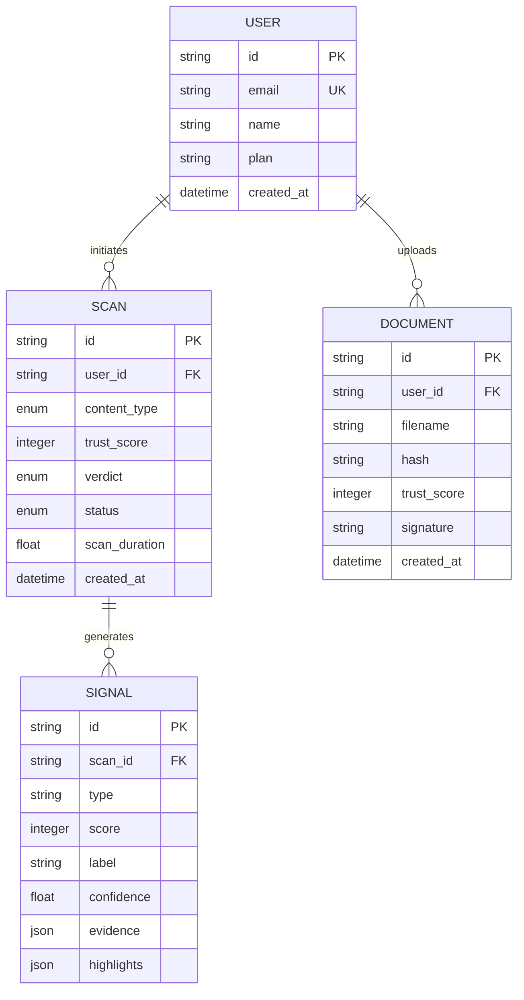
```mermaid
erDiagram
    USER ||--o{ SCAN : initiates
    USER ||--o{ DOCUMENT : uploads
    SCAN ||--o{ SIGNAL : generates
    
    USER {
        string id PK
        string email UK
        string name
        string plan
        datetime created_at
    }
    
    SCAN {
        string id PK
        string user_id FK
        enum content_type
        integer trust_score
        enum verdict
        enum status
        float scan_duration
        datetime created_at
    }
    
    SIGNAL {
        string id PK
        string scan_id FK
        string type
        integer score
        string label
        float confidence
        json evidence
        json highlights
    }
    
    DOCUMENT {
        string id PK
        string user_id FK
        string filename
        string hash
        integer trust_score
        string signature
        datetime created_at
    }
```
Sources: [truelens-backend/app/models/models.py:27-104]()

## Data Models Detailed Specification

### User Model
The `User` entity tracks account information and subscription tiers, which determines access limits such as scan counts and API availability.

| Field | Type | Description |
| :--- | :--- | :--- |
| `id` | String (UUID) | Unique identifier for the user. |
| `email` | String | Unique email address used for identification. |
| `name` | String | Display name of the user. |
| `plan` | String | Subscription tier (default: "free"). |
| `created_at` | DateTime | Timestamp of account creation (UTC). |

Sources: [truelens-backend/app/models/models.py:27-37](), [truelens-app/src/lib/types.ts:1-8]()

### Scan and Signal Models
Scans represent the top-level analysis request. Every scan is decomposed into multiple `Signal` objects, each representing a specific analysis vector (e.g., text stylometry, domain reputation, or image forensics).

| Model | Field | Type | Constraints |
| :--- | :--- | :--- | :--- |
| **Scan** | `content_type` | Enum | `url`, `text`, `file` |
| | `status` | Enum | `pending`, `processing`, `completed`, `failed` |
| | `verdict` | Enum | `Authentic`, `Suspicious`, `AI-Generated` |
| | `trust_score` | Integer | 0 to 100 aggregated score |
| **Signal** | `type` | String | e.g., `text`, `domain`, `provenance` |
| | `evidence` | JSON | Model-specific raw data (e.g., `avg_sentence_length`) |
| | `confidence` | Float | Probability/certainty of the signal result |

Sources: [truelens-backend/app/models/models.py:12-25, 40-77](), [truelens-backend/app/schemas/schemas.py:7-41]()

### Document Model
The `Document` model supports file-based verification. It includes fields for cryptographic integrity and tamper detection results.

```python
class Document(Base):
    __tablename__ = "documents"

    id = Column(String, primary_key=True, default=generate_uuid)
    user_id = Column(String, ForeignKey("users.id"), nullable=True)
    filename = Column(String, nullable=False)
    file_size = Column(Integer, nullable=False)
    file_type = Column(String, nullable=False)
    hash = Column(String, nullable=False, index=True) # SHA-256
    status = Column(String, default="pending")
    trust_score = Column(Integer, nullable=True)
    findings = Column(JSON, nullable=True) # Array of finding objects
    
    # Signature info
    signature = Column(String, nullable=True)
    public_key = Column(String, nullable=True)
    verified_at = Column(DateTime, nullable=True)
```
Sources: [truelens-backend/app/models/models.py:80-104]()

## Data Flow: From Request to Model
The system uses Pydantic schemas to validate data during transitions between the API layer and the database models.

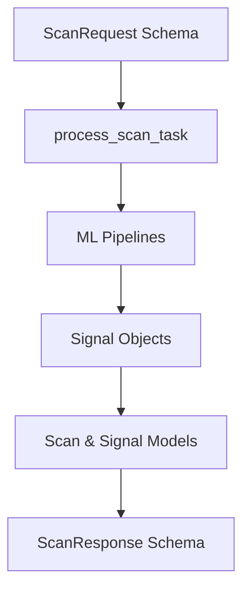
```mermaid
flowchart TD
    Req[ScanRequest Schema] --> Task[process_scan_task]
    Task --> ML[ML Pipelines]
    ML --> SignalData[Signal Objects]
    SignalData --> Commit[Scan & Signal Models]
    Commit --> Res[ScanResponse Schema]
```

1.  **Input Validation**: `ScanRequest` ensures that if `contentType` is "url", a URL is provided; if "text", raw text is provided.
2.  **Processing**: The Celery task `process_scan_task` updates the `Scan` status to `processing`.
3.  **Signal Generation**: ML pipelines (like `analyze_text_ml`) generate signal data including `trust_score` and `evidence`.
4.  **Persistence**: Data is committed to the database, mapping internal snake_case fields (e.g., `trust_score`) to frontend-friendly camelCase via the `ScanResponse` schema.

Sources: [truelens-backend/app/tasks/ml_pipeline.py:61-114](), [truelens-backend/app/schemas/schemas.py:27-41](), [truelens-app/src/app/api/v1/scans/route.ts:37-47]()

## Enumerations
The system strictly controls state and categorization through Python Enums, ensuring consistency across the ML pipeline and the UI.

- **ContentTypeEnum**: Defines the source of analysis (`url`, `text`, `file`).
- **ScanStatusEnum**: Tracks the lifecycle of an asynchronous task (`pending`, `processing`, `completed`, `failed`).
- **VerdictEnum**: The final categorization of authenticity (`Authentic`, `Suspicious`, `AI-Generated`).

Sources: [truelens-backend/app/models/models.py:12-25]()

## Conclusion
The TrueLens database schema serves as a robust foundation for multi-signal authenticity verification. By decoupling high-level "Scans" from granular "Signals," the architecture allows for the flexible addition of new ML models (e.g., image forensics or social proof analysis) without altering the core database structure. The inclusion of cryptographic signing fields within the Document model further extends the system's utility into the realm of verifiable digital credentials.

### Asynchronous Task Flow (Celery)

<details>
<summary>Relevant source files</summary>

The following files were used as context for generating this wiki page:

- [truelens-backend/app/tasks/ml_pipeline.py](https://github.com/Priyanshu-2005/TrueLens/blob/main/truelens-backend/app/tasks/ml_pipeline.py)
- [truelens-app/src/app/api/v1/scans/route.ts](https://github.com/Priyanshu-2005/TrueLens/blob/main/truelens-app/src/app/api/v1/scans/route.ts)
- [truelens-app/src/lib/analysis.ts](https://github.com/Priyanshu-2005/TrueLens/blob/main/truelens-app/src/lib/analysis.ts)
- [truelens-app/src/app/scan/page.tsx](https://github.com/Priyanshu-2005/TrueLens/blob/main/truelens-app/src/app/scan/page.tsx)
- [truelens-app/src/app/developers/page.tsx](https://github.com/Priyanshu-2005/TrueLens/blob/main/truelens-app/src/app/developers/page.tsx)
- [truelens-app/src/app/documents/page.tsx](https://github.com/Priyanshu-2005/TrueLens/blob/main/truelens-app/src/app/documents/page.tsx)
</details>

# Asynchronous Task Flow (Celery)

The Asynchronous Task Flow in TrueLens is designed to handle computationally expensive content analysis—such as AI text detection, domain reputation checks, and document forensics—without blocking the user interface. By offloading these operations to a background worker system (Celery), the application ensures a responsive experience while processing complex machine learning pipelines.

The flow begins with a client submission via the Next.js frontend, which proxies the request to a FastAPI backend. The backend initializes a scan record in the database and dispatches a task to the Celery worker queue. The worker then executes a multi-signal analysis pipeline, updates the scan status, and persists the final trust score and verdict.

## System Architecture

The task flow spans three primary layers: the Frontend (Next.js), the API Proxy/Backend, and the Asynchronous Worker (Celery).

### Task Submission and Proxying
When a user submits a URL or text for analysis, the frontend triggers a POST request to the internal API route. This route validates the input (e.g., ensuring text length is at least 50 characters) and proxies the request to the Python-based FastAPI backend.

Sources: [truelens-app/src/app/scan/page.tsx:28-60](), [truelens-app/src/app/api/v1/scans/route.ts:7-36]()

### Background Worker Logic
The core of the asynchronous flow is the `process_scan_task`. This task manages the lifecycle of a scan from "processing" to "completed" or "failed."

```mermaid
flowchart TD
    A[API Request Received] --> B[Create Scan Entry in DB]
    B --> C[Dispatch process_scan_task]
    C --> D{Check Scan Type}
    D -- URL --> E[Analyze Domain]
    D -- Text --> F[Analyze Text ML]
    E --> G[Extract Scraped Content]
    G --> F
    F --> H[Calculate Trust Score]
    H --> I[Update DB Status: Completed]
    I --> J[Return Success]
    
    subgraph Celery Worker
    D
    E
    F
    G
    H
    I
    end
```
*The diagram above illustrates the transition from synchronous API handling to the asynchronous execution within the Celery worker.*

Sources: [truelens-backend/app/tasks/ml_pipeline.py:65-104]()

## The ML Pipeline Task

The `process_scan_task` is the primary entry point for the Celery worker. It performs the following sequence of operations:

1.  **State Management:** Sets the scan status to `ScanStatusEnum.processing` to inform the UI that analysis is underway.
2.  **Signal Generation:** Based on the content type, it invokes specialized analysis functions like `analyze_domain` or `analyze_text_ml`.
3.  **Ensemble Scoring:** Aggregates scores from all generated signals to determine a final trust score (0-100).
4.  **Verdict Assignment:** Categorizes the result as `authentic`, `suspicious`, or `ai_generated`.
5.  **Persistence:** Saves detailed `Signal` objects and updates the `Scan` record with completion timestamps and duration.

Sources: [truelens-backend/app/tasks/ml_pipeline.py:65-115]()

### Analysis Signal Types

| Signal Type | Description | Primary Metric |
| :--- | :--- | :--- |
| **Text ML** | Stylometry analysis detecting AI-generated patterns. | Burstiness & Variance |
| **Domain** | Reputation and security analysis of hostnames. | TLD Trust & SSL |
| **Forensics** | Document-level tamper detection. | Pixel & Metadata Integrity |
| **Provenance** | Historical context and source matching. | Source Date & Matches |

Sources: [truelens-backend/app/tasks/ml_pipeline.py:10-50](), [truelens-app/src/lib/analysis.ts:133-188](), [truelens-app/src/lib/analysis.ts:271-315]()

## Sequence of Operations

The following sequence diagram details the communication between the client, the API, the Database, and the Celery Worker.

```mermaid
sequenceDiagram
    participant C as Client (Next.js)
    participant A as API / Backend
    participant D as Database
    participant W as Celery Worker

    C->>A: POST /api/v1/scans
    A->>D: Create Scan (Status: Pending)
    A->>W: process_scan_task(scan_id)
    A-->>C: 201 Created (scan_id)
    
    activate W
    W->>D: Update Status (Processing)
    W->>W: analyze_text_ml()
    W->>W: analyze_domain()
    W->>D: Insert Signals
    W->>D: Update Scan (Completed, Trust Score)
    deactivate W
    
    C->>A: GET /api/v1/scans/:id
    A->>D: Fetch Results
    D-->>A: Scan Record
    A-->>C: JSON Result (Signals & Score)
```
*The asynchronous nature is shown by the API returning a scan ID immediately to the client while the worker continues processing in the background.*

Sources: [truelens-app/src/app/developers/page.tsx:14-25](), [truelens-app/src/app/scan/page.tsx:55-70](), [truelens-backend/app/tasks/ml_pipeline.py:65-104]()

## Implementation Details

### Text Stylometry Heuristics
Within the asynchronous task, text is analyzed using a pure-Python stylometry engine. This avoids heavy transformer model dependencies while providing signals such as:
*   **Burstiness:** The variation in sentence lengths; AI text typically has low variance.
*   **Sentence Length Uniformity:** Calculated as `variance / max(avg_sentence_length, 1)`.
*   **Keyword Detection:** Identifying phrases like "as an AI language model."

Sources: [truelens-backend/app/tasks/ml_pipeline.py:10-45]()

### Document Forensic Flow
For document uploads, the flow includes a simulation of cryptographic signing and SHA-256 hashing. The `analyzeDocument` function runs format validation, metadata integrity checks, and arithmetic consistency (for invoices) as part of the processing pipeline.

Sources: [truelens-app/src/lib/analysis.ts:271-332](), [truelens-app/src/app/documents/page.tsx:43-65]()

## Conclusion
The Asynchronous Task Flow using Celery provides the necessary infrastructure for TrueLens to perform deep content inspection. By separating the ingestion of data from its analysis, the system maintains high availability and allows for scalable machine learning workloads that can take several seconds to complete without impacting the end-user's perception of performance.

### Frontend State Management

<details>
<summary>Relevant source files</summary>

The following files were used as context for generating this wiki page:

- [truelens-app/src/app/scan/page.tsx](https://github.com/Priyanshu-2005/TrueLens/blob/main/truelens-app/src/app/scan/page.tsx)
- [truelens-app/src/app/documents/page.tsx](https://github.com/Priyanshu-2005/TrueLens/blob/main/truelens-app/src/app/documents/page.tsx)
- [truelens-app/src/app/dashboard/page.tsx](https://github.com/Priyanshu-2005/TrueLens/blob/main/truelens-app/src/app/dashboard/page.tsx)
- [truelens-app/src/app/verify/page.tsx](https://github.com/Priyanshu-2005/TrueLens/blob/main/truelens-app/src/app/verify/page.tsx)
- [truelens-app/src/lib/types.ts](https://github.com/Priyanshu-2005/TrueLens/blob/main/truelens-app/src/lib/types.ts)
- [truelens-app/src/app/developers/page.tsx](https://github.com/Priyanshu-2005/TrueLens/blob/main/truelens-app/src/app/developers/page.tsx)
- [truelens-app/src/app/api/v1/scans/route.ts](https://github.com/Priyanshu-2005/TrueLens/blob/main/truelens-app/src/app/api/v1/scans/route.ts)
</details>

# Frontend State Management

TrueLens utilizes a decentralized state management approach primarily driven by React's native `useState` and `useEffect` hooks, complemented by server-side data fetching and client-side navigation. The application manages complex states for content scanning, document verification, and user dashboards by synchronizing local component state with backend API responses.

The architecture focuses on "Single Source of Truth" for specific views, where individual pages handle the lifecycle of data—from initial user input through asynchronous processing to the final display of trust scores and analytical signals.

Sources: [truelens-app/src/app/scan/page.tsx](), [truelens-app/src/app/documents/page.tsx]()

## Local UI State Management

Most interactive features in TrueLens rely on local state to manage user inputs and UI transitions. This includes handling tab switching between different analysis modes (e.g., URL vs. Text) and managing the visibility of modals for detailed document views.

### Input and Validation State
In the scanning module, state is used to track user input for URLs or raw text and to manage validation error messages before submitting data to the analysis engine.

```typescript
const [activeTab, setActiveTab] = useState<TabType>("url");
const [url, setUrl] = useState("");
const [text, setText] = useState("");
const [loading, setLoading] = useState(false);
const [error, setError] = useState("");
```
Sources: [truelens-app/src/app/scan/page.tsx:13-18]()

### UI Transitions and Feedback
Components use state to trigger loading animations and feedback loops. For instance, the `uploading` state in the document verification page controls the display of the `Loader2` component and progress messaging during file analysis.

Sources: [truelens-app/src/app/documents/page.tsx:16-17](), [truelens-app/src/app/documents/page.tsx:90-94]()

## Data Persistence and Synchronization

TrueLens synchronizes local frontend state with backend services through RESTful API endpoints. This process involves fetching historical data for dashboards and submitting new content for live analysis.

### Scan Lifecycle Flow
The following diagram illustrates how the frontend manages state throughout a content scan request, from user input to redirection.

```mermaid
flowchart TD
    A[User Input] --> B{Validate Format}
    B -- Invalid --> C[Set Error State]
    B -- Valid --> D[Set Loading: true]
    D --> E[POST /api/v1/scans]
    E --> F{Response OK?}
    F -- No --> G[Set Error Message]
    F -- Yes --> H[Redirect to /results/id]
    G --> I[Set Loading: false]
```
The scan process transitions from an idle input state to a global loading state (`ScanLoader`) before navigating to a results page based on the returned scan ID.
Sources: [truelens-app/src/app/scan/page.tsx:23-66](), [truelens-app/src/app/api/v1/scans/route.ts]()

### Dashboard and History State
The Dashboard manages an array of `Scan` objects and a `stats` object, fetching them on component mount to provide an overview of user activity.

| State Variable | Data Type | Purpose |
| :--- | :--- | :--- |
| `scans` | `Scan[]` | Stores list of previous analysis results |
| `stats` | `Object` | Aggregates counts for total, flagged, and authentic scans |
| `loading` | `boolean` | Determines if shimmer placeholders should be shown |

Sources: [truelens-app/src/app/dashboard/page.tsx:16-19]()

## Document Verification State

The document management system handles file-specific states, including drag-and-drop interactions and cryptographic verification results.

```mermaid
sequenceDiagram
    participant U as User
    participant C as DocumentsPage
    participant S as Server API
    U->>C: Drop File
    C->>C: setUploading(true)
    C->>S: POST /api/v1/documents (FormData)
    S-->>C: { success: true, document: Object }
    C->>C: setDocuments([newDoc, ...prev])
    C->>C: setSelectedDoc(newDoc)
    C->>C: setUploading(false)
```
This flow ensures that the UI updates immediately after a successful upload by prepending the new document to the existing list state.
Sources: [truelens-app/src/app/documents/page.tsx:44-65]()

### Verification Result Structures
The verification state for SHA-256 hashes or Scan IDs is structured to provide clear feedback on document integrity.

| Field | Type | Description |
| :--- | :--- | :--- |
| `verified` | `boolean` | Result of cryptographic signature check |
| `message` | `string` | Human-readable explanation of the result |
| `document` | `Document` | (Optional) Metadata of the matched document |

Sources: [truelens-app/src/app/verify/page.tsx:14-25](), [truelens-app/src/lib/types.ts:40-52]()

## Data Models for State
The application defines strict interfaces in `types.ts` to ensure consistency across different state management contexts. Key entities include:

*   **Scan**: Represents a content analysis session, including trust scores, verdicts, and an array of individual `Signal` objects.
*   **Document**: Represents a file-based analysis, containing SHA-256 hashes and optional cryptographic signatures.
*   **AnalysisResult**: A transient state used by the analysis engine to calculate confidence and highlights.

Sources: [truelens-app/src/lib/types.ts:12-23](), [truelens-app/src/lib/types.ts:63-71]()

## Conclusion
Frontend state management in TrueLens is localized and reactive, prioritizing immediate user feedback through loading states and error handling. By leveraging Next.js routing and standard React state patterns, the application maintains synchronization with the backend while managing complex data structures like multi-signal analysis results and tamper-detection findings.

### Data Contracts & Schemas

<details>
<summary>Relevant source files</summary>

The following files were used as context for generating this wiki page:

- [truelens-app/src/lib/types.ts](https://github.com/Priyanshu-2005/TrueLens/blob/main/truelens-app/src/lib/types.ts)
- [truelens-app/src/lib/analysis.ts](https://github.com/Priyanshu-2005/TrueLens/blob/main/truelens-app/src/lib/analysis.ts)
- [truelens-app/src/app/developers/page.tsx](https://github.com/Priyanshu-2005/TrueLens/blob/main/truelens-app/src/app/developers/page.tsx)
- [truelens-app/src/lib/store.ts](https://github.com/Priyanshu-2005/TrueLens/blob/main/truelens-app/src/lib/store.ts)
- [truelens-app/src/app/verify/page.tsx](https://github.com/Priyanshu-2005/TrueLens/blob/main/truelens-app/src/app/verify/page.tsx)
</details>

# Data Contracts & Schemas

## Introduction
Data Contracts and Schemas in TrueLens define the structural integrity and communication protocols between the frontend application, backend ML services, and the data persistence layer. These contracts ensure that content analysis—spanning text, URLs, and documents—is consistently represented through a unified set of interfaces and types.

The system relies on a multi-signal architecture where diverse analysis results (signals) are aggregated into high-level verdicts. By strictly defining schemas for entities like `Scan`, `Document`, and `Signal`, TrueLens maintains a reliable pipeline for detecting AI-generated content and fraudulent activity.

## Core Domain Entities
The TrueLens architecture is built around three primary entities: Scans, Documents, and Signals. These entities represent the lifecycle of a verification request from submission to result aggregation.

### The Scan Schema
A `Scan` represents an analysis request for web-based or raw text content. It tracks the input, the final trust score, and the ensemble of signals generated during processing.

| Field | Type | Description |
| :--- | :--- | :--- |
| `id` | `string` | Unique identifier for the scan. |
| `contentType` | `"url" \| "text" \| "file"` | The type of content submitted. |
| `trustScore` | `number` | Aggregated score (0-100). |
| `verdict` | `string` | Final classification: "Authentic", "Suspicious", or "AI-Generated". |
| `signals` | `Signal[]` | Array of individual analytical signals. |
| `status` | `string` | Lifecycle state: "pending", "processing", "completed", or "failed". |

Sources: [truelens-app/src/lib/types.ts:19-33]()

### The Document Schema
The `Document` entity is specifically designed for file-based verification, incorporating cryptographic hashes and tamper-detection findings.

```mermaid
classDiagram
    class Document {
        +string id
        +string filename
        +number fileSize
        +string hash
        +string status
        +number trustScore
        +DocumentFinding[] findings
        +DocumentSignature signature
    }
    class DocumentFinding {
        +string type
        +string severity
        +string message
    }
    class DocumentSignature {
        +string documentHash
        +string signature
        +string timestamp
        +string publicKey
    }
    Document *-- DocumentFinding
    Document *-- DocumentSignature
```
The relationship between a Document and its verification components.
Sources: [truelens-app/src/lib/types.ts:35-64]()

## Signal Analysis Framework
TrueLens uses an ensemble approach where a single content scan is broken down into multiple specific `Signal` objects. These signals are categorized by type and carry their own confidence levels and evidence payloads.

### Signal Structure
Every signal must adhere to a contract that provides enough detail for the frontend to render "explainable AI" components.

| Field | Type | Description |
| :--- | :--- | :--- |
| `type` | `string` | Category: "text", "image", "metadata", "review", "domain", "provenance". |
| `score` | `number` | The specific score for this signal (0-100). |
| `confidence` | `number` | Model confidence in this signal's accuracy (0.0 - 1.0). |
| `evidence` | `Record<string, any>` | Arbitrary key-value pairs containing raw data (e.g., word count, domain age). |
| `highlights` | `string[]` | Specific strings or sections of text flagged by the model. |

Sources: [truelens-app/src/lib/types.ts:10-18]()

### Stylometry & Feature Extraction
For text analysis, the system extracts specific features that are mapped into the `AnalysisResult` contract. This includes metrics like "Burstiness" and "Vocabulary Richness."

```typescript
interface TextFeatures {
  avgSentenceLength: number;
  sentenceLengthVariance: number;
  vocabularyRichness: number;
  punctuationDensity: number;
  burstiness: number;
  repetitionScore: number;
}
```
Sources: [truelens-app/src/lib/analysis.ts:9-20]()

## API Request/Response Contracts
The Developer Portal defines the external data contracts used for programmatic access to the TrueLens engine.

### Scan Submission
**Endpoint:** `POST /api/v1/scans`
**Request Contract:**
```json
{
  "url": "string (optional)",
  "text": "string (optional)",
  "contentType": "url | text"
}
```
**Response Contract:**
```json
{
  "success": true,
  "scan": {
    "id": "scan_abc123",
    "trustScore": 82,
    "verdict": "Authentic",
    "signals": []
  }
}
```
Sources: [truelens-app/src/app/developers/page.tsx:16-25](), [truelens-app/src/lib/types.ts:85-89]()

### Verification Verification
The `VerifyPage` and associated API contract allow users to check the authenticity of previously signed documents using a SHA-256 hash or Scan ID.

```mermaid
sequenceDiagram
    participant U as User
    participant V as Verify API
    participant S as Data Store
    U->>V: POST /api/v1/verify { hash/scanId }
    V->>S: Query by ID or Hash
    S-->>V: Document Record
    V-->>U: VerificationResult { verified: bool, message: string, document: {} }
```
Sequence of verification for signed documents.
Sources: [truelens-app/src/app/verify/page.tsx:32-45](), [truelens-app/src/lib/store.ts:114-116]()

## Data Persistence & State
While the prototype uses an in-memory `DataStore`, the schemas are designed to be compatible with relational databases. The store maintains two primary maps: `scans` and `documents`.

### Seed Data Patterns
The data store utilizes demo objects that illustrate the expected state of the contracts:
- **Scan Entry**: Includes `createdAt`, `completedAt`, and `scanDuration`.
- **Document Entry**: Includes a `signature` object containing a Base64-encoded cryptographic signature and a `publicKey`.

Sources: [truelens-app/src/lib/store.ts:11-105]()

## Summary
The Data Contracts and Schemas in TrueLens form a robust foundation for multi-modal content analysis. By standardizing the `Signal` and `Scan` interfaces, the system allows for the seamless addition of new ML models (e.g., provenance or image forensics) without breaking existing frontend or API implementations. This strict adherence to contracts ensures that every authenticity verdict is supported by transparent, structured evidence.


## Frontend Components

### Dashboard Interface

<details>
<summary>Relevant source files</summary>

The following files were used as context for generating this wiki page:

- [truelens-app/src/app/dashboard/page.tsx](https://github.com/Priyanshu-2005/TrueLens/blob/main/truelens-app/src/app/dashboard/page.tsx)
- [truelens-app/src/lib/types.ts](https://github.com/Priyanshu-2005/TrueLens/blob/main/truelens-app/src/lib/types.ts)
- [truelens-app/src/app/scan/page.tsx](https://github.com/Priyanshu-2005/TrueLens/blob/main/truelens-app/src/app/scan/page.tsx)
- [truelens-app/src/app/results/[id]/page.tsx](https://github.com/Priyanshu-2005/TrueLens/blob/main/truelens-app/src/app/results/%5Bid%5D/page.tsx)
- [truelens-app/src/app/developers/page.tsx](https://github.com/Priyanshu-2005/TrueLens/blob/main/truelens-app/src/app/developers/page.tsx)
- [truelens-app/src/lib/analysis.ts](https://github.com/Priyanshu-2005/TrueLens/blob/main/truelens-app/src/lib/analysis.ts)
</details>

# Dashboard Interface

The Dashboard Interface serves as the central hub for users to monitor their content verification activities within the TrueLens platform. It provides a high-level overview of scanning metrics, including total scans performed, average trust scores, and the distribution of authentic versus flagged content. Sources: [truelens-app/src/app/dashboard/page.tsx:1-25]()

The interface is designed to facilitate quick access to historical scan results and initiates new analysis workflows. It integrates data from the core analysis engine to present actionable insights through visual statistics and a detailed history log. Sources: [truelens-app/src/app/dashboard/page.tsx:85-110](), [truelens-app/src/lib/types.ts:24-36]()

## Architecture and Data Flow

The Dashboard is a client-side component that fetches user-specific scan data and aggregate statistics from the internal API. It utilizes React hooks for state management and Framer Motion for interface animations. Sources: [truelens-app/src/app/dashboard/page.tsx:1-20]()

### Data Retrieval Sequence
The following diagram illustrates how the Dashboard populates its interface upon loading:

```mermaid
sequenceDiagram
    participant User as "User Browser"
    participant Dash as "Dashboard Page"
    participant API as "API (/api/v1/scans)"
    participant Lib as "Analysis Library"

    User->>Dash: Access /dashboard
    Dash->>API: GET request for scans & stats
    API->>Lib: Retrieve Scan[] and Stats object
    Lib-->>API: Return scan data
    API-->>Dash: JSON { scans: Scan[], stats: Object }
    Dash->>Dash: Update state (setScans, setStats)
    Dash-->>User: Render updated UI
```
The dashboard component triggers an asynchronous `fetchData` call within a `useEffect` hook to populate the `scans` and `stats` states. Sources: [truelens-app/src/app/dashboard/page.tsx:21-36]()

## Key Components

### 1. Statistics Cards
The dashboard displays four primary metrics to provide immediate feedback on verification performance:

| Metric | Description | Source |
| :--- | :--- | :--- |
| **Total Scans** | The cumulative number of content analyses performed by the user. | [truelens-app/src/app/dashboard/page.tsx:43]() |
| **Avg Trust Score** | The mean trust score across all scans, colored dynamically based on the value. | [truelens-app/src/app/dashboard/page.tsx:49]() |
| **Authentic** | Count of scans resulting in an "Authentic" verdict (Trust Score ≥ 70). | [truelens-app/src/app/dashboard/page.tsx:55]() |
| **Flagged** | Count of scans resulting in "Suspicious" or "AI-Generated" verdicts. | [truelens-app/src/app/dashboard/page.tsx:61]() |

### 2. Scan History Log
The history log provides a chronological list of previous analyses. Each entry displays:
*   **Content Type**: Indicated by icons for URLs (Globe) or Text (FileText). Sources: [truelens-app/src/app/dashboard/page.tsx:136-140]()
*   **Trust Score**: A visual indicator ranging from 0-100, styled with dynamic colors (Success, Warning, or Danger). Sources: [truelens-app/src/app/dashboard/page.tsx:125-133]()
*   **Metadata**: Includes the creation date (formatted via `formatDate`) and the number of detection signals identified. Sources: [truelens-app/src/app/dashboard/page.tsx:146-150]()

## Integration with Analysis Systems

The Dashboard acts as a gateway to the detailed `ResultsPage` and the `ScanPage`. When a user clicks a history item, the application routes them to `/results/[id]`, which retrieves deep-dive signal breakdowns. Sources: [truelens-app/src/app/results/[id]/page.tsx:20-40]()

### Signal Weights and Scoring
The trust scores displayed on the dashboard are calculated using weighted signals defined in the analysis logic:

```mermaid
flowchart TD
    subgraph InputProcessing
        A[URL/Text Input] --> B{Content Type}
    end

    subgraph AnalysisEngine
        B -- URL --> C[Domain Analysis - 25%]
        B -- URL/Text --> D[Text Stylometry - 40%]
        B -- URL --> E[Provenance Check - 5%]
        F[Image Forensics - 20%]
        G[Review Patterns - 10%]
    end

    C & D & E & F & G --> H[Ensemble Trust Score]
    H --> I[Dashboard Overview]
```
Sources: [truelens-app/src/lib/analysis.ts:251-258]()

## Data Structures

The dashboard relies on the `Scan` and `Signal` interfaces to render content accurately.

```typescript
// truelens-app/src/lib/types.ts:24-36
export interface Scan {
  id: string;
  url?: string;
  text?: string;
  contentType: "url" | "text" | "file";
  trustScore: number;
  verdict: "Authentic" | "Suspicious" | "AI-Generated";
  signals: Signal[];
  status: "pending" | "processing" | "completed" | "failed";
  createdAt: string;
}
```

## Developer Portal Access
From the dashboard, users with API requirements can navigate to the Developer Portal. This section provides access to API keys and endpoints for programmatically submitting scans via POST `/api/v1/scans`. Sources: [truelens-app/src/app/developers/page.tsx:10-40]()

## Summary
The Dashboard Interface provides a comprehensive management layer for TrueLens users, abstracting complex ML analysis into readable statistics and a manageable history. It serves as the primary navigation point between content submission, detailed result viewing, and developer integration. Sources: [truelens-app/src/app/dashboard/page.tsx:10-20]()

### Scanning & Results Interface

<details>
<summary>Relevant source files</summary>

The following files were used as context for generating this wiki page:

- [truelens-app/src/app/scan/page.tsx](https://github.com/Priyanshu-2005/TrueLens/blob/main/truelens-app/src/app/scan/page.tsx)
- [truelens-app/src/app/results/%5Bid%5D/page.tsx](https://github.com/Priyanshu-2005/TrueLens/blob/main/truelens-app/src/app/results/%5Bid%5D/page.tsx)
- [truelens-app/src/lib/analysis.ts](https://github.com/Priyanshu-2005/TrueLens/blob/main/truelens-app/src/lib/analysis.ts)
- [truelens-app/src/lib/types.ts](https://github.com/Priyanshu-2005/TrueLens/blob/main/truelens-app/src/lib/types.ts)
- [truelens-app/src/app/api/v1/scans/route.ts](https://github.com/Priyanshu-2005/TrueLens/blob/main/truelens-app/src/app/api/v1/scans/route.ts)
- [truelens-app/src/components/ScanLoader.tsx](https://github.com/Priyanshu-2005/TrueLens/blob/main/truelens-app/src/components/ScanLoader.tsx)
</details>

# Scanning & Results Interface

The Scanning & Results Interface serves as the primary user interaction layer for content authenticity verification. It enables users to submit digital content—either via public URLs or raw text—to a multi-signal analysis pipeline that evaluates the likelihood of AI generation or manipulation.

The system transitions from an input stage, where data is validated and sent to a backend proxy, through a visual loading state that represents the analysis pipeline, and finally to a detailed results dashboard. This dashboard provides an ensemble "Trust Score," a categorical verdict, and a breakdown of individual signals such as stylometry and domain reputation.

## Content Submission Architecture

The submission interface is a tabbed React component that supports two primary content types: `url` and `text`. It enforces client-side validation rules to ensure data quality before initiating the analysis.

### Validation Logic
- **URL Analysis**: Must be a well-formed URL (e.g., using the `URL` constructor).
- **Text Analysis**: Requires a minimum of 50 characters to provide enough data for meaningful stylometry and linguistic analysis.

Sources: [truelens-app/src/app/scan/page.tsx:14-43](), [truelens-app/src/app/api/v1/scans/route.ts:16-24]()

### Data Flow for Analysis Requests
The following diagram illustrates the lifecycle of a scan request from the UI through the API proxy to the results page.

```mermaid
sequenceDiagram
    participant User as "User Interface"
    participant NextProxy as "Next.js API Route"
    participant Backend as "FastAPI ML Service"
    participant Results as "Results Page"

    User->>NextProxy: POST /api/v1/scans {url, text, contentType}
    NextProxy->>Backend: POST /api/v1/scans/ {url, text, content_type}
    Backend-->>NextProxy: JSON {trust_score, verdict, signals, ...}
    NextProxy-->>User: JSON {success: true, scan: {id, ...}}
    User->>Results: Redirect to /results/[id]
    Results->>NextProxy: GET /api/v1/scans/[id]
    NextProxy-->>Results: Scan Detail Object
```
Sources: [truelens-app/src/app/scan/page.tsx:47-70](), [truelens-app/src/app/api/v1/scans/route.ts:7-50](), [truelens-app/src/app/results/%5Bid%5D/page.tsx:29-43]()

## Analysis Pipeline & Signals

The interface relies on an underlying analysis engine that processes content through various specialized signals. For URL-based scans, the system performs an ensemble analysis combining text, domain, and provenance checks.

### Signal Types
The system categorizes findings into the following signal types:

| Signal Type | Description | Key Metrics |
| :--- | :--- | :--- |
| **Text** | Stylometry and linguistic analysis for AI detection. | Burstiness, Vocabulary Richness, Sentence Variance. |
| **Domain** | Evaluation of the source website's credibility. | TLD trust, HTTPS status, Subdomain depth. |
| **Provenance** | Verification of content history and original sources. | Source matches, earliest known date. |
| **Metadata** | Forensic analysis of file-level attributes. | EXIF data, timestamp integrity. |

Sources: [truelens-app/src/lib/types.ts:12-21](), [truelens-app/src/lib/analysis.ts:187-251]()

### Scoring Algorithm
The final `trustScore` is a weighted average of individual signals, adjusted by the `confidence` level of each model.

```mermaid
graph TD
    A[Raw Content] --> B{Content Type?}
    B -- text --> C[Stylometry Engine]
    B -- url --> C
    B -- url --> D[Domain Trust Engine]
    B -- url --> E[Provenance Check]
    
    C --> F[Ensemble Scorer]
    D --> F
    E --> F
    
    F --> G[Trust Score 0-100]
    G --> H[Verdict: Authentic/Suspicious/AI]
```
Sources: [truelens-app/src/lib/analysis.ts:254-282]()

## Results Visualization

Once analysis is complete, the `ResultsPage` component fetches the scan by ID and renders a comprehensive breakdown.

### Trust Score & Verdicts
The "Verdict" is determined based on the computed ensemble score:
- **Authentic**: Score ≥ 70
- **Suspicious**: 40 ≤ Score < 70
- **AI-Generated**: Score < 40

Sources: [truelens-app/src/lib/analysis.ts:284-287](), [truelens-app/src/lib/types.ts:31]()

### Component Structure
1. **Source Overview**: Displays the original URL or a truncated version of the analyzed text, along with a timestamp and scan duration.
2. **Trust Score Gauge**: A visual circular indicator representing the aggregate score.
3. **Signal Breakdown**: A list of `SignalCard` components. Each card details a specific analysis facet, including a label (e.g., "Likely Human-Written"), a confidence percentage, and specific "highlights" or evidence (e.g., "Low vocabulary diversity detected").

Sources: [truelens-app/src/app/results/%5Bid%5D/page.tsx:106-159](), [truelens-app/src/lib/analysis.ts:122-140]()

## Technical Implementation Details

### Data Models
The interface is driven by the `Scan` and `Signal` interfaces.

```typescript
export interface Signal {
  id: string;
  type: "text" | "image" | "metadata" | "review" | "domain" | "provenance";
  score: number;
  label: string;
  confidence: number;
  evidence: Record<string, unknown>;
  highlights?: string[];
}

export interface Scan {
  id: string;
  contentType: "url" | "text" | "file";
  trustScore: number;
  verdict: "Authentic" | "Suspicious" | "AI-Generated";
  signals: Signal[];
  scanDuration?: number;
}
```
Sources: [truelens-app/src/lib/types.ts:12-38]()

### UI States & Transitions
- **ScanLoader**: A specialized component used during the `loading` state of both submission and result fetching. It provides visual feedback on the pipeline progress, including steps for "Fetching content," "Text analysis," and "Computing trust score."
- **Sharing**: Users can copy the unique result URL to the clipboard via the `handleCopyLink` function, which uses the `navigator.clipboard` API.

Sources: [truelens-app/src/components/ScanLoader.tsx:64-83](), [truelens-app/src/app/results/%5Bid%5D/page.tsx:45-49]()

## Conclusion
The Scanning & Results Interface facilitates a robust workflow for content verification. By abstracting complex ML-driven stylometry and domain reputation analysis into a simple trust score and detailed signal breakdown, it provides users with transparent and actionable evidence regarding digital authenticity.

### Authentication Interfaces

<details>
<summary>Relevant source files</summary>

The following files were used as context for generating this wiki page:

- [truelens-app/src/app/login/page.tsx](https://github.com/Priyanshu-2005/TrueLens/blob/main/truelens-app/src/app/login/page.tsx)
- [truelens-app/src/app/register/page.tsx](https://github.com/Priyanshu-2005/TrueLens/blob/main/truelens-app/src/app/register/page.tsx)
- [truelens-app/src/app/developers/page.tsx](https://github.com/Priyanshu-2005/TrueLens/blob/main/truelens-app/src/app/developers/page.tsx)
- [truelens-app/src/lib/types.ts](https://github.com/Priyanshu-2005/TrueLens/blob/main/truelens-app/src/lib/types.ts)
- [truelens-app/src/app/dashboard/page.tsx](https://github.com/Priyanshu-2005/TrueLens/blob/main/truelens-app/src/app/dashboard/page.tsx)
- [truelens-app/src/components/Footer.tsx](https://github.com/Priyanshu-2005/TrueLens/blob/main/truelens-app/src/components/Footer.tsx)
</details>

# Authentication Interfaces

## Introduction

Authentication Interfaces in TrueLens provide the primary gateway for users and developers to access the platform's AI-powered verification features. These interfaces encompass traditional credential-based entry, third-party OAuth integrations, and programmatic access via API keys. The system is designed to transition users from public-facing landing pages to personalized dashboards where they can manage scans and documents.

The scope of these interfaces includes the user registration process, secure login mechanisms, and the developer portal for managing API-based authentication. These components ensure that access to advanced features like high-volume scanning, document signing, and historical analysis is restricted to authorized entities.

Sources: [truelens-app/src/app/login/page.tsx](), [truelens-app/src/app/register/page.tsx](), [truelens-app/src/app/developers/page.tsx]()

## User Authentication Components

The project implements user-facing authentication through dedicated Next.js pages that handle registration and session entry. These interfaces utilize React state management to capture user credentials and Framer Motion for UI transitions.

### Registration Interface
The registration page allows new users to create accounts by providing their full name, email, and a password. It also facilitates onboarding via OAuth providers.

*   **Key State Variables:** `name`, `email`, `password`.
*   **Redirect Logic:** Successful form submission routes the user to the `/dashboard`.

Sources: [truelens-app/src/app/register/page.tsx:11-16](), [truelens-app/src/app/register/page.tsx:18-21]()

### Login Interface
The login page serves as the reentry point for existing users, requiring email and password credentials.

*   **Key State Variables:** `email`, `password`.
*   **OAuth Integration:** Buttons are provided for "Continue with Google" and "Continue with GitHub".

Sources: [truelens-app/src/app/login/page.tsx:11-13](), [truelens-app/src/app/login/page.tsx:40-62]()

### Authentication Flow Diagram
The following diagram illustrates the user flow through the authentication interfaces into the protected application state.

```mermaid
flowchart TD
    Start[User Visits App] --> Choice{Has Account?}
    Choice -- No --> Register[Register Page]
    Choice -- Yes --> Login[Login Page]
    
    subgraph Auth_Methods [Authentication Methods]
        EmailPass[Email/Password Form]
        GoogleAuth[Google OAuth]
        GitHubAuth[GitHub OAuth]
    end
    
    Register --> EmailPass
    Register --> GoogleAuth
    Register --> GitHubAuth
    
    Login --> EmailPass
    Login --> GoogleAuth
    Login --> GitHubAuth
    
    EmailPass --> Dash[User Dashboard]
    GoogleAuth --> Dash
    GitHubAuth --> Dash
```
The diagram shows the branching logic for new and returning users, supporting both native forms and third-party providers.
Sources: [truelens-app/src/app/login/page.tsx](), [truelens-app/src/app/register/page.tsx]()

## Developer and API Authentication

For programmatic access, TrueLens employs an API Key-based authentication system. This is managed through the Developer Portal and utilized by external clients to interact with the analysis engine.

### API Key Structure
API keys are used to authenticate requests to the `/api/v1/*` endpoints. They are passed via the `Authorization` header as a Bearer token.

Sources: [truelens-app/src/app/developers/page.tsx:64-68](), [truelens-app/src/lib/types.ts:70-80]()

### Programmatic Authentication Examples

| Language | Method | Header Requirement |
| :--- | :--- | :--- |
| cURL | `-H` | `Authorization: Bearer YOUR_API_KEY` |
| Node.js | `fetch` headers | `'Authorization': 'Bearer YOUR_API_KEY'` |
| Python | `requests` headers | `'Authorization': 'Bearer YOUR_API_KEY'` |

Sources: [truelens-app/src/app/developers/page.tsx:63-100]()

## Data Models

The following table describes the data structures relevant to authentication and user identity within the system.

### User and API Key Schemas

| Field | Type | Description |
| :--- | :--- | :--- |
| `User.plan` | `free`, `pro`, `enterprise` | Determines rate limits and feature access. |
| `ApiKey.keyPrefix` | `string` | A visible prefix for identifying keys in the UI. |
| `ApiKey.scopes` | `string[]` | Permission sets associated with the token. |
| `ApiKey.rateLimit` | `number` | Maximum allowed requests for the specific key. |

Sources: [truelens-app/src/lib/types.ts:1-7](), [truelens-app/src/lib/types.ts:70-80]()

## Access Control Logic

Upon successful authentication, users are redirected to the Dashboard, which fetches personalized statistics and scan history based on their identity.

```mermaid
sequenceDiagram
    participant U as User
    participant UI as Login Interface
    participant API as Backend API
    participant DS as DataStore
    
    U->>UI: Enters Credentials
    UI->>API: POST /api/v1/auth (Simulated)
    API->>DS: Validate User
    DS-->>API: User Record + Plan
    API-->>UI: Auth Success (Redirect)
    UI->>U: Show /dashboard
    U->>API: GET /api/v1/scans
    API-->>U: Personalized Scan History
```
The sequence shows the transition from the authentication interface to the retrieval of user-specific data.
Sources: [truelens-app/src/app/login/page.tsx:18-22](), [truelens-app/src/app/dashboard/page.tsx:24-34]()

## Summary

The Authentication Interfaces of TrueLens provide a multi-modal approach to platform access. Users can authenticate via standard forms or OAuth providers (Google/GitHub), while developers utilize a structured API Key system. These interfaces are critical for enforcing the platform's tier-based pricing (Free, Pro, Enterprise) and securing the analysis signals generated by the backend.

Sources: [truelens-app/src/app/developers/page.tsx:173-210](), [truelens-app/src/components/Footer.tsx:32-35]()

### Core UI Components

<details>
<summary>Relevant source files</summary>

The following files were used as context for generating this wiki page:

- [truelens-app/src/app/page.tsx](https://github.com/Priyanshu-2005/TrueLens/blob/main/truelens-app/src/app/page.tsx)
- [truelens-app/src/app/scan/page.tsx](https://github.com/Priyanshu-2005/TrueLens/blob/main/truelens-app/src/app/scan/page.tsx)
- [truelens-app/src/app/documents/page.tsx](https://github.com/Priyanshu-2005/TrueLens/blob/main/truelens-app/src/app/documents/page.tsx)
- [truelens-app/src/app/dashboard/page.tsx](https://github.com/Priyanshu-2005/TrueLens/blob/main/truelens-app/src/app/dashboard/page.tsx)
- [truelens-app/src/app/verify/page.tsx](https://github.com/Priyanshu-2005/TrueLens/blob/main/truelens-app/src/app/verify/page.tsx)
- [truelens-app/src/app/globals.css](https://github.com/Priyanshu-2005/TrueLens/blob/main/truelens-app/src/app/globals.css)
- [truelens-app/src/lib/types.ts](https://github.com/Priyanshu-2005/TrueLens/blob/main/truelens-app/src/lib/types.ts)
</details>

# Core UI Components

The Core UI Components of TrueLens constitute the visual and interactive layer of the AI-powered content verification platform. These components are designed using a "glassmorphism" aesthetic, utilizing high-transparency backgrounds, background blurs, and vibrant brand-specific gradients to provide a modern, technical interface for authenticity analysis.

The architecture follows a modular Next.js pattern, where UI components are categorized into high-level page views (Scan, Dashboard, Documents, Verify) and reusable design tokens defined via Tailwind CSS and global CSS variables. These components facilitate user interactions such as content submission, real-time analysis visualization, and cryptographic verification status reporting.

Sources: [truelens-app/src/app/page.tsx](), [truelens-app/src/app/globals.css:1-50](), [truelens-app/README.md]()

## Design System and Global Styling

The design system is built on a custom palette of "TrueLens Design Tokens" defined in the global CSS. It prioritizes dark mode accessibility with a primary background of `#09090B` and a brand identity centered around deep violet and vibrant purple hues.

### Visual Foundations
| Token Type | Variable Name | Value / Description |
| :--- | :--- | :--- |
| **Brand Colors** | `--brand-mid` | `#7C3AED` (Main brand purple) |
| **Status (Success)** | `--success` | `#10B981` (Used for authentic/verified states) |
| **Status (Danger)** | `--danger` | `#EF4444` (Used for flagged/AI-generated states) |
| **Surface** | `.glass-card` | 70% opacity zinc background with 16px blur |
| **Typography** | `--font-sans` | Inter (Standard) |
| **Typography** | `--font-mono` | JetBrains Mono (For hashes and code) |

Sources: [truelens-app/src/app/globals.css:4-70]()

### Styling Classes
The application utilizes specialized utility classes to maintain visual consistency:
*   **`.glass-card`**: Implements the core container style with backdrop filtering and subtle borders.
*   **`.btn-primary`**: A gradient-based button (`--brand-mid` to `--brand-deep`) with hover-state shadows.
*   **`.shimmer`**: An animated gradient used to indicate loading states in data-heavy views like the Dashboard.
*   **`.pulse-glow`**: An animation used for verification status indicators.

Sources: [truelens-app/src/app/globals.css:98-120](), [truelens-app/src/app/globals.css:220-235]()

## Content Analysis Interface

The Content Analysis module is the primary entry point for users to submit data. It supports two distinct input methods: URL Analysis and Text Analysis.

### Input Selection and Validation
The interface uses a state-managed tab system (`url` | `text`). 
*   **URL Analysis**: Requires a valid URL format; it is intended for news articles, product pages, or social media.
*   **Text Analysis**: Requires a minimum of 50 characters to ensure the ML pipeline has sufficient stylometry data for analysis.

Sources: [truelens-app/src/app/scan/page.tsx:10-30]()

### Submission Flow
The following diagram illustrates the component interaction when a user submits content for scanning:

```mermaid
flowchart TD
    A[User Input: URL/Text] --> B{Validate Input}
    B -- Invalid --> C[Display Error Message]
    B -- Valid --> D[Set Loading: ScanLoader]
    D --> E[POST /api/v1/scans]
    E --> F{Response OK?}
    F -- Yes --> G[Navigate to Results Page]
    F -- No --> C
```
The interface provides immediate feedback via `ScanLoader` while waiting for the ensemble ML pipeline to return trust scores.

Sources: [truelens-app/src/app/scan/page.tsx:32-75](), [truelens-app/src/app/scan/page.tsx:120-145]()

## Document Verification System

The document system handles file uploads, cryptographic hash displays, and verification status badges. It is designed to detect tampered documents and verify digital signatures.

### Upload and Status Tracking
Documents are processed through a drag-and-drop zone or a file picker. The UI tracks four primary statuses: `pending`, `analyzing`, `verified`, and `flagged`.

```mermaid
stateDiagram-v2
    [*] --> Pending: Upload Started
    Pending --> Analyzing: API Received
    Analyzing --> Verified: Integrity Check Passed
    Analyzing --> Flagged: Tampering/AI Detected
    Verified --> [*]
    Flagged --> [*]
```

### Document Metadata Display
When a document is selected, the UI presents a detailed modal containing:
*   **SHA-256 Hash**: The unique fingerprint of the file.
*   **Findings List**: A breakdown of specific issues (e.g., "Font Consistency", "QR Code Check") with severity levels (`low`, `medium`, `high`).
*   **Verification Signature**: A section dedicated to TrueLens-signed cryptographic metadata.

Sources: [truelens-app/src/app/documents/page.tsx:120-210](), [truelens-app/src/lib/types.ts:35-50]()

## Analytics and Dashboard Components

The Dashboard serves as a central hub for user activity, utilizing data-dense components to summarize scan history and trust metrics.

### Stat Cards and Historical Data
The dashboard employs a grid of statistical cards to display aggregate metrics such as total scans and average trust scores. The history list uses consistent iconography to differentiate between source types (Globe for URLs, FileText for text).

| Component | Function | Icon / Color Reference |
| :--- | :--- | :--- |
| **Trust Score Badge** | High-level verdict | Green (>=70), Amber (>=40), Red (<40) |
| **Stat Card** | Metric summary | Themed by `getScoreColor` logic |
| **History Item** | Navigates to results | `ArrowRight` with hover transition |

Sources: [truelens-app/src/app/dashboard/page.tsx:40-80](), [truelens-app/src/app/dashboard/page.tsx:130-160]()

## Verification Portal

The Verification Portal allows users to manually verify the authenticity of a document or scan by providing its SHA-256 hash or Scan ID.

### Logic Flow
The component determines if the input is a 64-character hex hash or a standard ID and queries the verification endpoint. The result UI is dynamically styled:
*   **Success**: A "pulse-glow" animation with a `CheckCircle` icon and a green border.
*   **Failure**: An `XCircle` icon with a red border and a specific error message.

Sources: [truelens-app/src/app/verify/page.tsx:30-60](), [truelens-app/src/app/verify/page.tsx:120-150]()

```mermaid
sequenceDiagram
    participant U as User
    participant V as VerifyPage
    participant API as API Server
    U->>V: Enter Hash/ID
    V->>API: POST /api/v1/verify
    API-->>V: VerificationResult
    Note right of V: Dynamic styling based on 'verified' boolean
    V->>U: Show Success/Failure UI
```

## Summary
The Core UI Components of TrueLens provide a sophisticated interface for AI transparency and content trust. By combining real-time analysis loaders, cryptographic status indicators, and a unified design system, the UI ensures that complex ML-derived data is accessible and actionable for developers and end-users alike.

Sources: [truelens-app/src/app/layout.tsx](), [truelens-app/src/app/globals.css]()

### Frontend Utilities & Analysis Helpers

<details>
<summary>Relevant source files</summary>

The following files were used as context for generating this wiki page:

- [truelens-app/src/lib/utils.ts](https://github.com/Priyanshu-2005/TrueLens/blob/main/truelens-app/src/lib/utils.ts)
- [truelens-app/src/lib/analysis.ts](https://github.com/Priyanshu-2005/TrueLens/blob/main/truelens-app/src/lib/analysis.ts)
- [truelens-app/src/lib/types.ts](https://github.com/Priyanshu-2005/TrueLens/blob/main/truelens-app/src/lib/types.ts)
- [truelens-app/src/app/api/v1/scans/route.ts](https://github.com/Priyanshu-2005/TrueLens/blob/main/truelens-app/src/app/api/v1/scans/route.ts)
- [truelens-app/src/app/developers/page.tsx](https://github.com/Priyanshu-2005/TrueLens/blob/main/truelens-app/src/app/developers/page.tsx)
- [truelens-app/src/app/dashboard/page.tsx](https://github.com/Priyanshu-2005/TrueLens/blob/main/truelens-app/src/app/dashboard/page.tsx)

</details>

# Frontend Utilities & Analysis Helpers

## Introduction
The Frontend Utilities & Analysis Helpers module provides the core logic for content verification, data transformation, and UI consistency within the TrueLens application. This module serves as a bridge between the raw user input (URLs, text, or documents) and the visual representation of trust scores and authenticity signals. It encompasses text stylometry analysis, domain reputation scoring, and general-purpose utility functions for formatting and styling.

The scope of this system includes local heuristic analysis used for immediate feedback, ensemble scoring logic that aggregates multiple signals, and API integration helpers that manage communication between the Next.js frontend and the FastAPI backend service.

## Analysis Engine Logic

The analysis engine utilizes a multi-signal approach to evaluate the authenticity of submitted content. It performs stylometry on text, reputation checks on domains, and integrity validation on uploaded documents.

### Text Stylometry Analysis
The text analysis engine extracts linguistic features to differentiate between human-written and AI-generated content. It calculates metrics such as vocabulary richness, sentence length variance, and "burstiness"—a measure of variation in paragraph lengths.

```mermaid
flowchart TD
    Input[Raw Text Input] --> Extract[Extract Text Features]
    Extract --> SLV[Sentence Length Variance]
    Extract --> VR[Vocabulary Richness]
    Extract --> B[Burstiness]
    Extract --> RD[Repetition & Density]
    
    SLV & VR & B & RD --> Score[Analyze Text Score]
    Score --> Result[Analysis Result: Score, Label, Highlights]
```
The following features are extracted for evaluation:
*   **Burstiness:** Variation in paragraph lengths, where higher variation often indicates human authorship.
*   **Vocabulary Richness:** The ratio of unique words to total words.
*   **Repetition Score:** Frequency of word repetition, used to flag potential AI patterns.
*   **Stylometry Details:** Average word length, exclamation counts, and all-caps ratios.

Sources: [truelens-app/src/lib/analysis.ts:11-73](), [truelens-app/src/lib/analysis.ts:75-132]()

### Domain & URL Evaluation
For URL-based scans, the system evaluates the hostname against known trust patterns and suspicious Top-Level Domains (TLDs).

| Criteria | Impact | Description |
| :--- | :--- | :--- |
| **Trusted TLDs** | +10 Score | Includes .com, .org, .edu, .gov, .io. |
| **Suspicious TLDs** | -20 Score | Includes .xyz, .top, .click, .buzz, .ml. |
| **Trusted Domains** | +25 Score | Known entities like google.com, bbc.com, nature.com. |
| **Security** | +/- Score | HTTPS presence adds +5; absence subtracts -15. |
| **Patterns** | -10 Score | Excessive hyphens or long numeric strings in the domain. |

Sources: [truelens-app/src/lib/analysis.ts:135-188]()

### Ensemble Scoring Model
TrueLens uses a weighted ensemble model to calculate the final "Trust Score." Each signal type is assigned a specific weight based on its reliability in the overall authenticity verdict.

| Signal Type | Weight |
| :--- | :--- |
| **Text Analysis** | 40% |
| **Domain Analysis** | 25% |
| **Image Forensics** | 20% |
| **Review Analysis** | 10% |
| **Provenance** | 05% |

Sources: [truelens-app/src/lib/analysis.ts:191-197]()

## Data Models & API Integration

The application relies on standardized TypeScript interfaces to ensure type safety across the analysis pipeline and the UI components.

### Core Data Structures
The `Scan` and `Document` interfaces represent the primary entities within the system.

```mermaid
classDiagram
    class Scan {
        +string id
        +string url
        +string contentType
        +number trustScore
        +string verdict
        +Signal[] signals
        +string status
    }
    class Signal {
        +string id
        +string type
        +number score
        +string label
        +number confidence
        +string[] highlights
    }
    class Document {
        +string id
        +string filename
        +string hash
        +number trustScore
        +DocumentFinding[] findings
        +DocumentSignature signature
    }
    Scan "1" *-- "many" Signal
    Document "1" *-- "many" DocumentFinding
```
Sources: [truelens-app/src/lib/types.ts:14-63]()

### API Communication Flow
The Next.js frontend communicates with a FastAPI backend via internal route handlers. These handlers act as a proxy, mapping snake_case backend responses to camelCase frontend expectations.

```mermaid
sequenceDiagram
    participant UI as Client Component
    participant Route as Next.js API Route
    participant BE as FastAPI Backend
    UI->>Route: POST /api/v1/scans (JSON)
    Route->>BE: POST /api/v1/scans/ (Proxy)
    BE-->>Route: 200 OK (Snake_Case)
    Note over Route: Map data to camelCase
    Route-->>UI: 200 OK (CamelCase)
```
Sources: [truelens-app/src/app/api/v1/scans/route.ts:5-52]()

## UI Helpers & Formatting

Common utility functions are centralized to maintain visual and functional consistency, specifically regarding the representation of trust scores and dates.

### Trust Score Visualization
The system maps numerical scores (0-100) to specific colors, labels, and CSS classes used in badges and gauges.

| Score Range | Label | Color Variable | Badge Class |
| :--- | :--- | :--- | :--- |
| **>= 70** | Authentic | `--success` | `badge-success` |
| **40 - 69** | Suspicious | `--warning` | `badge-warning` |
| **< 40** | AI-Generated | `--danger` | `badge-danger` |

Sources: [truelens-app/src/lib/utils.ts:7-23]()

### General Utilities
*   **formatDate:** Converts ISO strings or Date objects into a human-readable format: `MMM DD, YYYY, HH:MM AM/PM`.
*   **truncateText:** Limits string length for UI displays, appending an ellipsis if the text exceeds the specified maximum length.
*   **cn (Class Name):** A utility combining `clsx` and `tailwind-merge` to handle conditional Tailwind CSS classes efficiently.

Sources: [truelens-app/src/lib/utils.ts:3-36]()

## Summary
Frontend Utilities & Analysis Helpers form the logic backbone of TrueLens. By combining local heuristic analysis (stylometry and domain checks) with a structured API proxy and standardized UI utilities, the system provides a cohesive experience for verifying digital content. The ensemble scoring model ensures that final verdicts are balanced across multiple indicators of authenticity.


## Backend Systems

### Python API Endpoints

<details>
<summary>Relevant source files</summary>

The following files were used as context for generating this wiki page:

- [truelens-backend/app/main.py](https://github.com/Priyanshu-2005/TrueLens/blob/main/truelens-backend/app/main.py)
- [truelens-app/src/app/developers/page.tsx](https://github.com/Priyanshu-2005/TrueLens/blob/main/truelens-app/src/app/developers/page.tsx)
- [truelens-backend/app/models/models.py](https://github.com/Priyanshu-2005/TrueLens/blob/main/truelens-backend/app/models/models.py)
- [truelens-backend/app/tasks/ml_pipeline.py](https://github.com/Priyanshu-2005/TrueLens/blob/main/truelens-backend/app/tasks/ml_pipeline.py)
- [truelens-app/src/app/api/v1/scans/route.ts](https://github.com/Priyanshu-2005/TrueLens/blob/main/truelens-app/src/app/api/v1/scans/route.ts)
- [truelens-app/src/app/api/v1/documents/route.ts](https://github.com/Priyanshu-2005/TrueLens/blob/main/truelens-app/src/app/api/v1/documents/route.ts)

</details>

# Python API Endpoints

The Python API serves as the core backend for the TrueLens platform, providing ML-powered content verification and document analysis. Built with FastAPI, it exposes a set of RESTful endpoints that handle the ingestion of URLs, raw text, and physical documents for authenticity scanning. The backend integrates with a PostgreSQL database via SQLAlchemy for persistent storage of scan results, user data, and cryptographic signatures.

The architecture follows a proxy pattern where a Next.js frontend interacts with internal API routes that forward requests to this Python service. Computationally intensive tasks, such as stylometric analysis and domain reputation checks, are offloaded to an asynchronous ML pipeline using Celery to ensure high responsiveness.

Sources: [truelens-backend/app/main.py:1-29](), [truelens-app/src/app/api/v1/scans/route.ts:6-48]()

## API Architecture and Routing

The Python backend is initialized as a FastAPI application with CORS middleware enabled specifically to allow communication from the Next.js frontend (typically hosted at `http://localhost:3000`). Routing is organized under the `/api/v1` prefix and is modularized using a central `api_router`.

```mermaid
graph TD
    UI[User Interface] --> NextJS[Next.js API Routes]
    NextJS -- Proxy Request --> FastAPI[FastAPI Backend]
    FastAPI --> Router[API Router /api/v1]
    Router --> Scans[Scans Endpoint]
    Router --> Docs[Documents Endpoint]
    Router --> Health[Health Check]
    Scans --> Celery[Celery ML Pipeline]
    Docs --> DB[(PostgreSQL)]
```
The diagram shows the multi-layered request flow from the user interface through the Next.js proxy to the specialized Python API endpoints.
Sources: [truelens-backend/app/main.py:7-29](), [truelens-app/src/app/api/v1/scans/route.ts:25-30]()

### Core Endpoints

The following table summarizes the primary endpoints exposed by the Python backend service:

| Endpoint | Method | Description | Data Model |
| :--- | :--- | :--- | :--- |
| `/api/v1/scans` | POST | Submits content (URL or text) for ML analysis. | `Scan` |
| `/api/v1/scans` | GET | Lists all historical scans and their verdicts. | `Scan` |
| `/api/v1/scans/{id}` | GET | Retrieves detailed results for a specific scan ID. | `Scan`, `Signal` |
| `/api/v1/documents/verify` | POST | Uploads and verifies documents for tamper detection. | `Document` |
| `/api/v1/health` | GET | Returns the operational status of the API. | N/A |

Sources: [truelens-app/src/app/developers/page.tsx:16-55](), [truelens-backend/app/main.py:24-27]()

## Scan and Analysis Logic

When a scan is initiated via `/api/v1/scans`, the system validates the content type (URL or text). For text analysis, the backend requires a minimum of 50 characters to perform meaningful stylometry. The analysis is processed through an ML pipeline that generates "Signals"—individual evidence components that contribute to a final "Trust Score."

### ML Pipeline Signal Generation
The pipeline calculates a `fake_probability` based on linguistic features such as burstiness (sentence length variance) and uniform text structures. These are then converted into a Trust Score where 100 indicates high authenticity.

```mermaid
sequenceDiagram
    participant API as FastAPI
    participant Task as Celery Worker
    participant ML as ML Heuristics
    participant DB as Database

    API->>DB: Create Scan (Status: pending)
    API->>Task: process_scan_task(scan_id)
    Task->>DB: Update Status: processing
    Task->>ML: analyze_text_ml(raw_text)
    ML-->>Task: Return score, confidence, highlights
    Task->>DB: Save Signals
    Task->>DB: Update Scan (Status: completed, trust_score)
    Task-->>API: Task Success
```
The sequence above illustrates the asynchronous processing of content analysis, ensuring the API does not block while performing heavy stylometric calculations.
Sources: [truelens-backend/app/tasks/ml_pipeline.py:53-100](), [truelens-app/src/app/api/v1/scans/route.ts:13-22]()

## Document Verification System

The document endpoint handles multipart form data for file uploads. The backend performs format validation, metadata integrity checks, and tamper detection. If a document is deemed authentic, the system generates a cryptographic signature.

### Document Data Structure
Documents are stored with metadata including file size, type, and a SHA-256 hash. The `signature` field contains the results of the verification process, allowing for tamper-evident tracking.

| Field | Type | Description |
| :--- | :--- | :--- |
| `id` | String | Unique UUID for the document. |
| `hash` | String | SHA-256 hash of the document content. |
| `status` | String | Verification state (pending, analyzing, verified, flagged). |
| `trust_score`| Integer | Calculated score based on analysis findings. |
| `signature` | String | Cryptographic signature for verified files. |

Sources: [truelens-backend/app/models/models.py:80-101](), [truelens-app/src/app/api/v1/documents/route.ts:10-44]()

## Data Models and Relationships

The backend uses a relational schema to link users to their scans and documents. The `Signal` entity is particularly important as it provides the granular evidence for every scan verdict.

```mermaid
classDiagram
    class User {
        +String id
        +String email
        +String plan
        +DateTime created_at
    }
    class Scan {
        +String id
        +Enum content_type
        +Integer trust_score
        +Enum verdict
        +Enum status
    }
    class Signal {
        +String id
        +String type
        +Integer score
        +Float confidence
        +JSON evidence
    }
    class Document {
        +String id
        +String filename
        +String hash
        +String signature
    }

    User "1" -- "*" Scan : performs
    User "1" -- "*" Document : uploads
    Scan "1" -- "*" Signal : contains
```
This class diagram highlights the one-to-many relationships between users and their verification history, and between scans and their supporting ML signals.
Sources: [truelens-backend/app/models/models.py:28-103]()

## Conclusion
The Python API Endpoints form the analytical engine of TrueLens. By combining FastAPI's performance with asynchronous ML task processing, the system provides real-time authenticity verdicts. The structured separation between "Scans" (for web content/text) and "Documents" (for file uploads) allows the platform to address diverse trust issues ranging from AI-generated text to digital document forgery.

### Next.js BFF API Routes

<details>
<summary>Relevant source files</summary>

The following files were used as context for generating this wiki page:

- [truelens-app/src/app/api/v1/scans/route.ts](https://github.com/Priyanshu-2005/TrueLens/blob/main/truelens-app/src/app/api/v1/scans/route.ts)
- [truelens-app/src/app/api/v1/documents/route.ts](https://github.com/Priyanshu-2005/TrueLens/blob/main/truelens-app/src/app/api/v1/documents/route.ts)
- [truelens-app/src/app/verify/page.tsx](https://github.com/Priyanshu-2005/TrueLens/blob/main/truelens-app/src/app/verify/page.tsx)
- [truelens-app/src/app/developers/page.tsx](https://github.com/Priyanshu-2005/TrueLens/blob/main/truelens-app/src/app/developers/page.tsx)
- [truelens-app/src/lib/types.ts](https://github.com/Priyanshu-2005/TrueLens/blob/main/truelens-app/src/lib/types.ts)
- [truelens-app/src/app/scan/page.tsx](https://github.com/Priyanshu-2005/TrueLens/blob/main/truelens-app/src/app/scan/page.tsx)
</details>

# Next.js BFF API Routes

The Next.js Backend-for-Frontend (BFF) API routes in TrueLens act as a secure intermediary layer between the client-side application and the core Python/FastAPI backend. This architectural pattern provides a unified interface for the frontend to perform content scanning, document verification, and result retrieval while handling request validation and data transformation.

The primary purpose of these routes is to proxy requests to the FastAPI backend (located at `NEXT_PUBLIC_API_URL`), translate naming conventions (e.g., mapping `snake_case` from the backend to `camelCase` for the frontend), and enforce preliminary validation rules such as minimum character counts for text analysis.

Sources: [truelens-app/src/app/api/v1/scans/route.ts:3-5](), [truelens-app/src/app/api/v1/documents/route.ts:3-5](), [truelens-app/src/app/developers/page.tsx:14-53]()

## Architecture and Data Flow

The BFF layer follows a proxy pattern where incoming HTTP requests from the React frontend are validated and then forwarded to the corresponding FastAPI endpoint. This setup ensures that environment-specific configurations like the `BACKEND_URL` are abstracted away from the client.

### Proxy Mechanism
Each route typically defines an asynchronous function for standard HTTP methods (GET, POST). These functions extract the request body or parameters, perform initial error checking, and use the `fetch` API to communicate with the internal service.

```mermaid
flowchart TD
    Client[Frontend Client] -->|HTTP Request| BFF[Next.js BFF Route]
    BFF -->|Validation| Val{Is Valid?}
    Val -->|No| Error[400 Bad Request]
    Val -->|Yes| Proxy[Proxy to FastAPI]
    Proxy -->|fetch| Backend[Python Backend :8000]
    Backend -->|Response| Transform[Data Transformation]
    Transform -->|CamelCase| Client
```
The diagram shows the request-response lifecycle where the BFF validates input before hitting the core backend.
Sources: [truelens-app/src/app/api/v1/scans/route.ts:6-45](), [truelens-app/src/app/api/v1/documents/route.ts:6-40]()

## Key API Modules

### Content Scans Module
This module handles the submission of URLs and raw text for AI analysis. It enforces a strict validation rule where text must be at least 50 characters to ensure meaningful signal detection.

| Endpoint | Method | Purpose | Input |
| :--- | :--- | :--- | :--- |
| `/api/v1/scans` | POST | Submits content for analysis | `{ url?, text?, contentType }` |
| `/api/v1/scans` | GET | Lists scan history | None |
| `/api/v1/scans/:id` | GET | Retrieves a specific scan | Scan ID in path |

Sources: [truelens-app/src/app/api/v1/scans/route.ts:6-85](), [truelens-app/src/app/developers/page.tsx:14-25]()

### Document Verification Module
This module processes file uploads for tamper detection and cryptographic signing. Unlike text scans, this route handles `multipart/form-data` to transfer binary files to the backend.

```mermaid
sequenceDiagram
    participant UI as User Interface
    participant BFF as Document Route
    participant BE as FastAPI Backend
    UI->>BFF: POST /api/v1/documents (FormData)
    BFF->>BE: POST /api/v1/documents/verify
    BE-->>BFF: JSON (snake_case + Signature)
    Note right of BFF: Map file_size to fileSize
    BFF-->>UI: JSON (camelCase + Signature)
```
The sequence illustrates the transformation of backend data into a frontend-friendly format.
Sources: [truelens-app/src/app/api/v1/documents/route.ts:6-55](), [truelens-app/src/app/documents/page.tsx:43-65]()

## Data Transformation and Mapping

A critical role of the BFF is aligning the backend's data structures with the frontend's `lib/types.ts`. This involves mapping keys and restructuring objects, particularly for document signatures.

### Type Conversions
The system converts several key fields during the proxy response phase:
- `content_type` → `contentType`
- `trust_score` → `trustScore`
- `scan_duration` → `scanDuration`
- `file_size` → `fileSize`

### Signature Structure
For documents, the BFF constructs a `DocumentSignature` object from multiple top-level backend fields.

```typescript
// Mapping logic from documents/route.ts
const document = {
  ...data,
  fileSize: data.file_size,
  signature: data.signature ? {
    documentHash: data.hash,
    signature: data.signature,
    publicKey: data.public_key,
    timestamp: data.verified_at,
    scanId: data.id,
    verdict: data.status,
  } : undefined
};
```
Sources: [truelens-app/src/app/api/v1/documents/route.ts:44-55](), [truelens-app/src/lib/types.ts:49-56]()

## Security and Error Handling

The BFF layer acts as a safety net, catching network errors and backend failures before they reach the user interface.

1.  **Request Validation:** Returns a `400` status if `contentType` is missing or if the payload does not match the expected `url`/`text` requirement.
2.  **Backend Connectivity:** If the FastAPI service is unreachable, the BFF returns a `500 Internal Server Error` with a descriptive message like "Internal server error connecting to backend."
3.  **Graceful Degradation:** Routes utilize `try-catch` blocks to ensure that even if the backend returns malformed JSON, the frontend receives a structured error response.

Sources: [truelens-app/src/app/api/v1/scans/route.ts:51-60](), [truelens-app/src/app/api/v1/documents/route.ts:64-70](), [truelens-app/src/app/verify/page.tsx:42-50]()

## Conclusion
The Next.js BFF API Routes serve as the backbone of the TrueLens application architecture, facilitating seamless communication between the client and the analysis engine. By centralizing validation, data mapping, and proxy logic, the system maintains a clean separation of concerns while ensuring that the frontend remains decoupled from backend implementation details.

### Health Monitoring & Telemetry

<details>
<summary>Relevant source files</summary>

The following files were used as context for generating this wiki page:

- [truelens-app/src/app/api/v1/health/route.ts](https://github.com/Priyanshu-2005/TrueLens/blob/main/truelens-app/src/app/api/v1/health/route.ts)
- [truelens-app/src/app/developers/page.tsx](https://github.com/Priyanshu-2005/TrueLens/blob/main/truelens-app/src/app/developers/page.tsx)
- [truelens-app/src/app/dashboard/page.tsx](https://github.com/Priyanshu-2005/TrueLens/blob/main/truelens-app/src/app/dashboard/page.tsx)
- [truelens-app/src/lib/analysis.ts](https://github.com/Priyanshu-2005/TrueLens/blob/main/truelens-app/src/lib/analysis.ts)
- [truelens-app/src/lib/store.ts](https://github.com/Priyanshu-2005/TrueLens/blob/main/truelens-app/src/lib/store.ts)
- [truelens-app/src/app/results/[id]/page.tsx](https://github.com/Priyanshu-2005/TrueLens/blob/main/truelens-app/src/app/results/%5Bid%5D/page.tsx)
</details>

# Health Monitoring & Telemetry

## Introduction
Health Monitoring & Telemetry in TrueLens provides critical insights into the operational status of the platform and the performance of its AI-driven analysis pipeline. The system encompasses standard health check endpoints for service availability and detailed telemetry related to scan performance, trust score distributions, and signal processing durations.

The primary goal of this module is to ensure system reliability and provide developers with transparency into how the ensemble scoring engine performs during content verification tasks. This includes tracking analysis time, scan success rates, and the health of integrated ML services.

Sources: [truelens-app/src/app/api/v1/health/route.ts](), [truelens-app/src/app/developers/page.tsx:43-47](), [truelens-app/src/lib/analysis.ts:186-258]()

## System Health Monitoring
The platform maintains a dedicated health check infrastructure to verify that the API and its underlying services are operational. This is primarily exposed via the `/api/v1/health` endpoint, which returns basic status and version information.

### Health Check Endpoint
The health endpoint is a lightweight service check designed for load balancers and monitoring tools to determine if the TrueLens application is responsive.

| Property | Type | Description |
| :--- | :--- | :--- |
| `status` | string | Current health status (e.g., "healthy") |
| `version` | string | Current deployment version (e.g., "1.0.0") |

Sources: [truelens-app/src/app/api/v1/health/route.ts](), [truelens-app/src/app/developers/page.tsx:43-47]()

```mermaid
flowchart TD
    Client[Monitoring Client] --> LB[Load Balancer]
    LB --> HealthAPI[GET /api/v1/health]
    HealthAPI --> Response{Service Status}
    Response -- Success --> Healthy[200 OK: status: healthy]
    Response -- Failure --> Unhealthy[5xx Error: Service Down]
```
The diagram shows the standard flow for a health check request from an external monitoring client.
Sources: [truelens-app/src/app/api/v1/health/route.ts]()

## Performance Telemetry
TrueLens captures granular performance data during the content analysis process. This telemetry is embedded within scan results to help developers understand the computational overhead and latency of different signal types.

### Analysis Duration Tracking
The analysis engine measures the time taken for the entire ensemble scoring process, from the initial request to the final verdict calculation. This is reported as `scanDuration` in seconds.

*   **Ensemble Start:** Records `startTime` using `Date.now()`.
*   **Ensemble End:** Calculates `scanDuration` by subtracting `startTime` from the current time.
*   **Granularity:** Captured at the individual scan level.

Sources: [truelens-app/src/lib/analysis.ts:187](), [truelens-app/src/lib/analysis.ts:256](), [truelens-app/src/app/results/[id]/page.tsx:125-127]()

### Analysis Process Flow
The processing telemetry tracks the lifecycle of an analysis request through multiple signal processors.

```mermaid
sequenceDiagram
    participant API as Analysis Engine
    participant Text as Text Processor
    participant Dom as Domain Processor
    participant Store as Data Store
    
    API->>API: Mark startTime
    activate API
    API->>Text: extractTextFeatures()
    Text-->>API: Features + Score
    API->>Dom: analyzeDomain()
    Dom-->>API: Domain Metadata
    API->>API: Calculate scanDuration
    API->>Store: createScan(result)
    deactivate API
    API-->>Store: telemetry logged
```
The sequence diagram illustrates how performance metrics are gathered during a standard analysis lifecycle.
Sources: [truelens-app/src/lib/analysis.ts:186-258](), [truelens-app/src/lib/store.ts:145-148]()

## Data Store Telemetry & Metrics
The platform aggregates scan activity to provide a high-level overview of system usage and content authenticity trends. These metrics are processed by the `DataStore` and exposed through the dashboard.

### Core Metrics Summary
The system tracks four primary KPIs for operational awareness:

| Metric | Derivation Logic | Purpose |
| :--- | :--- | :--- |
| **Total Scans** | Count of all entries in the `scans` Map. | Monitors overall platform utilization. |
| **Avg Trust Score** | Mathematical mean of all recorded `trustScore` values. | Tracks the general quality/authenticity of analyzed content. |
| **Flagged Count** | Count of scans where `verdict !== "Authentic"`. | Identifies the volume of suspicious or AI-generated content. |
| **Authentic Count** | Count of scans where `verdict === "Authentic"`. | Tracks the volume of verified human content. |

Sources: [truelens-app/src/lib/store.ts:161-171](), [truelens-app/src/app/dashboard/page.tsx:43-65]()

### Data Persistence Schema
Telemetry and health data are structured within the `Scan` and `Document` types to ensure consistent reporting.

```mermaid
classDiagram
    class Scan {
        +string id
        +number trustScore
        +string verdict
        +string status
        +string createdAt
        +number scanDuration
        +Signal[] signals
    }
    class Signal {
        +string type
        +number score
        +number confidence
        +Record evidence
    }
    class Document {
        +string id
        +string status
        +number trustScore
        +DocumentFinding[] findings
    }
    Scan "1" *-- "many" Signal : contains
```
The class diagram shows how performance data (scanDuration) and health indicators (status, confidence) are associated with core data entities.
Sources: [truelens-app/src/lib/types.ts:12-50]()

## Conclusion
The Health Monitoring & Telemetry system in TrueLens provides essential visibility into the platform's analysis engine. By combining basic service health checks with detailed performance tracking (scan duration) and aggregate usage metrics (authentic vs. flagged counts), the system allows for proactive maintenance and provides users with transparent evidence for every authenticity verdict.

Sources: [truelens-app/src/lib/store.ts:161-171](), [truelens-app/src/lib/analysis.ts:258]()


## Model Integration

### Machine Learning Pipeline Integration

<details>
<summary>Relevant source files</summary>

The following files were used as context for generating this wiki page:

- [truelens-backend/app/tasks/ml_pipeline.py](https://github.com/Priyanshu-2005/TrueLens/blob/main/truelens-backend/app/tasks/ml_pipeline.py)
- [truelens-app/src/lib/analysis.ts](https://github.com/Priyanshu-2005/TrueLens/blob/main/truelens-app/src/lib/analysis.ts)
- [truelens-app/src/lib/types.ts](https://github.com/Priyanshu-2005/TrueLens/blob/main/truelens-app/src/lib/types.ts)
- [truelens-app/src/app/api/v1/scans/route.ts](https://github.com/Priyanshu-2005/TrueLens/blob/main/truelens-app/src/app/api/v1/scans/route.ts)
- [truelens-app/src/app/scan/page.tsx](https://github.com/Priyanshu-2005/TrueLens/blob/main/truelens-app/src/app/scan/page.tsx)
- [truelens-app/src/app/documents/page.tsx](https://github.com/Priyanshu-2005/TrueLens/blob/main/truelens-app/src/app/documents/page.tsx)
</details>

# Machine Learning Pipeline Integration

The Machine Learning (ML) Pipeline Integration in TrueLens is a multi-faceted system designed to evaluate the authenticity of digital content through stylometric analysis, domain reputation checks, and document forensics. It operates across a distributed architecture, utilizing a Next.js frontend for initial processing and a Python-based Celery backend for intensive asynchronous analysis.

The pipeline's primary objective is to generate a "Trust Score" and a corresponding "Verdict" (Authentic, Suspicious, or AI-Generated) by aggregating various signals. These signals include text patterns, domain metadata, and structural document integrity.

Sources: [truelens-backend/app/tasks/ml_pipeline.py:79-99](), [truelens-app/src/lib/analysis.ts:181-224]()

## System Architecture and Data Flow

The integration follows a producer-consumer model where the frontend application or API submits scan requests that are subsequently processed by an asynchronous task queue.

### High-Level Scan Workflow
The workflow begins when a user submits a URL or raw text. The request is proxied through a Next.js API route to a FastAPI backend, which triggers a Celery task for the ML pipeline.

```mermaid
flowchart TD
    User[User Interface] --> API[Next.js API Route]
    API --> FastAPI[FastAPI Backend]
    FastAPI --> Celery[Celery Task Queue]
    subgraph Pipeline [ML Pipeline Processing]
        Celery --> Text[Stylometry Analysis]
        Celery --> Domain[Domain Analysis]
        Celery --> Ensemble[Ensemble Scoring]
    end
    Ensemble --> DB[(PostgreSQL)]
    DB --> Results[Results Interface]
```
The diagram shows the transition from user input to backend task processing and final database storage.
Sources: [truelens-app/src/app/api/v1/scans/route.ts:7-40](), [truelens-backend/app/tasks/ml_pipeline.py:72-88]()

## Core Analysis Engines

### Stylometric Text Analysis
The text analysis engine uses pure-Python heuristics to detect AI-generated content, focusing on "Burstiness" and sentence uniformity. AI models typically produce text with low variance in sentence length compared to human-written content.

Key metrics calculated include:
*   **Average Sentence Length**: The mean number of words per sentence.
*   **Burstiness (Variance)**: The variation in sentence lengths, used as a primary indicator of human vs. AI authorship.
*   **Keyword Detection**: Specifically flagging phrases like "as an AI language model."

Sources: [truelens-backend/app/tasks/ml_pipeline.py:10-44](), [truelens-app/src/lib/analysis.ts:14-65]()

### Domain and URL Analysis
When a URL is submitted, the pipeline assesses the credibility of the host domain. This includes checking for suspicious Top-Level Domains (TLDs), domain age, HTTPS encryption, and subdomain depth.

| Metric | Impact on Score | Description |
| :--- | :--- | :--- |
| Trusted TLDs | +10 | Includes .com, .org, .gov, .edu |
| Suspicious TLDs | -20 | Includes .xyz, .top, .click, .buzz |
| Known Trusted Domains | +25 | Recognition of major news or academic sites |
| HTTPS Protocol | +5 / -15 | Presence or absence of encryption |
| Domain Patterns | -10 | Excessive hyphens or numeric strings |

Sources: [truelens-app/src/lib/analysis.ts:121-168](), [truelens-backend/app/tasks/ml_pipeline.py:84]()

### Document Forensics
Document verification focuses on structural integrity and tamper detection for uploaded files (PDF, PNG, JPG).

```mermaid
flowchart TD
    Doc[Document Upload] --> Type[Format Validation]
    Type --> Meta[Metadata Integrity]
    Meta --> Tamper[Tamper Detection]
    Tamper --> Font[Font Consistency]
    Font --> Sign[Cryptographic Signing]
```
The flow represents the sequential checks performed on documents to identify potential manipulations.
Sources: [truelens-app/src/app/documents/page.tsx:135-155](), [truelens-app/src/lib/analysis.ts:230-260]()

## Ensemble Scoring Logic

The final Trust Score is calculated using a weighted ensemble of individual signals. Each signal type is assigned a weight based on its reliability in the overall authenticity verdict.

| Signal Type | Weight | Implementation File |
| :--- | :--- | :--- |
| Text Analysis | 0.40 | `ml_pipeline.py` |
| Domain Analysis | 0.25 | `analysis.ts` |
| Image Analysis | 0.20 | `analysis.ts` |
| Review Patterns | 0.10 | `store.ts` |
| Provenance | 0.05 | `analysis.ts` |

The formula for the ensemble trust score is:
`Trust Score = Σ (Signal Score * Signal Confidence * Weight) / Σ (Weight * Signal Confidence)`

Sources: [truelens-app/src/lib/analysis.ts:208-223](), [truelens-backend/app/tasks/ml_pipeline.py:87-90]()

## Data Models and API Integration

### Scan and Signal Structures
The system uses standardized interfaces to ensure consistency between the Python backend and TypeScript frontend.

```python
# Backend processing logic (Python)
def process_scan_task(self, scan_id: str):
    # Transition status to processing
    scan.status = ScanStatusEnum.processing
    
    # Calculate average fake probability
    avg_fake_prob = sum(s["score"] for s in signals_data) / len(signals_data)
    final_trust_score = int(100 - avg_fake_prob)
```
Sources: [truelens-backend/app/tasks/ml_pipeline.py:72-105]()

### API Scan Request
Endpoints for submitting content for analysis expect specific JSON payloads defined in the `ScanRequest` and `Scan` types.

```typescript
// Frontend Type Definition
export interface Scan {
  id: string;
  contentType: "url" | "text" | "file";
  trustScore: number;
  verdict: "Authentic" | "Suspicious" | "AI-Generated";
  signals: Signal[];
  status: "pending" | "processing" | "completed" | "failed";
}
```
Sources: [truelens-app/src/lib/types.ts:21-35](), [truelens-app/src/app/api/v1/scans/route.ts:10-15]()

## Summary
The Machine Learning Pipeline Integration provides a robust framework for content verification by combining stylometric heuristics with domain and document forensics. By utilizing a weighted ensemble scoring system, it translates complex technical signals into an understandable Trust Score, enabling users and developers to make informed decisions about the authenticity of digital information.

Sources: [truelens-backend/app/tasks/ml_pipeline.py:108-112](), [truelens-app/src/lib/analysis.ts:224]()


## Deployment & Infrastructure

### Deployment & Infrastructure Guide

<details>
<summary>Relevant source files</summary>

The following files were used as context for generating this wiki page:

- [truelens-app/README.md](https://github.com/Priyanshu-2005/TrueLens/blob/main/truelens-app/README.md)
- [truelens-app/package.json](https://github.com/Priyanshu-2005/TrueLens/blob/main/truelens-app/package.json)
- [truelens-app/src/app/developers/page.tsx](https://github.com/Priyanshu-2005/TrueLens/blob/main/truelens-app/src/app/developers/page.tsx)
- [truelens-app/src/lib/analysis.ts](https://github.com/Priyanshu-2005/TrueLens/blob/main/truelens-app/src/lib/analysis.ts)
- [truelens-app/src/app/scan/page.tsx](https://github.com/Priyanshu-2005/TrueLens/blob/main/truelens-app/src/app/scan/page.tsx)
- [truelens-app/src/app/documents/page.tsx](https://github.com/Priyanshu-2005/TrueLens/blob/main/truelens-app/src/app/documents/page.tsx)
- [truelens-app/src/app/verify/page.tsx](https://github.com/Priyanshu-2005/TrueLens/blob/main/truelens-app/src/app/verify/page.tsx)
</details>

# Deployment & Infrastructure Guide

This guide details the technical infrastructure and deployment strategies for TrueLens, an AI-powered content verification platform. The system is designed to provide trust scores and authenticity metrics for web content, text, and documents using a multi-signal machine learning pipeline.

TrueLens leverages a modern web stack primarily built on Next.js, facilitating high-performance rendering and a scalable API layer for analyzing digital assets. The infrastructure supports real-time analysis, cryptographic document signing, and a public REST API for developer integration.

Sources: [truelens-app/README.md:1-5](), [truelens-app/src/app/developers/page.tsx:112-132](), [truelens-app/src/lib/analysis.ts:169-180]()

## Core Application Stack

The TrueLens application is built using the Next.js framework, utilizing React 19 for the frontend and a built-in API route system for the backend logic.

### Technology Summary
| Component | Technology | Description |
| :--- | :--- | :--- |
| **Framework** | Next.js 16.2.6 | Provides SSR, ISR, and API route capabilities. |
| **Frontend Library** | React 19.2.4 | UI component management. |
| **Styling** | Tailwind CSS 4 | Utility-first CSS framework for responsive design. |
| **Animations** | Framer Motion | Handles complex UI transitions and loading states. |
| **Icons** | Lucide React | Consistent iconography across the platform. |
| **Utility** | TypeScript | Ensures type safety across the analysis pipeline. |

Sources: [truelens-app/package.json:1-35](), [truelens-app/README.md:1-5]()

### Build and Execution Scripts
The project defines standard Node.js scripts for lifecycle management:
*   `npm run dev`: Starts the local development server on `localhost:3000`.
*   `npm run build`: Compiles the application for production deployment.
*   `npm run start`: Runs the compiled Next.js production server.
*   `npm run lint`: Executes ESLint for code quality checks.

Sources: [truelens-app/package.json:6-11](), [truelens-app/README.md:9-17]()

## Deployment Infrastructure

TrueLens is optimized for deployment on the Vercel platform, which provides native support for Next.js features such as Edge functions and automatic scaling.

### Environment & Hosting
The application environment requires Node.js version 20 or higher. The infrastructure is designed to be hosted as a serverless application, where API endpoints and page renders are treated as isolated functions.

```mermaid
graph TD
    User[End User] --> Internet((Internet))
    Internet --> Vercel[Vercel Edge Network]
    subgraph App_Infrastructure [Next.js Infrastructure]
        Vercel --> UI[Frontend Pages]
        Vercel --> API[API Routes /api/v1/*]
        API --> Analysis[Analysis Engine]
        API --> Crypto[Crypto/Signing Service]
    end
    Analysis --> ML_Services[External ML Models]
```
The diagram shows how requests flow through the Vercel Edge network to reach the specialized internal services.
Sources: [truelens-app/README.md:27-31](), [truelens-app/package.json:24]()

## API & Analysis Workflow

The platform exposes a versioned REST API (`/api/v1/`) for content analysis and document verification. This infrastructure allows developers to integrate TrueLens signals into external applications.

### Endpoint Infrastructure
| Method | Endpoint | Purpose | Required Payload |
| :--- | :--- | :--- | :--- |
| `POST` | `/api/v1/scans` | Submit URL/Text for ML analysis | `url` or `text`, `contentType` |
| `GET` | `/api/v1/scans/:id` | Retrieve historical scan results | N/A |
| `POST` | `/api/v1/documents` | Upload document for integrity check | `FormData` (file) |
| `POST` | `/api/v1/verify` | Verify cryptographic hash | `hash` or `scanId` |
| `GET` | `/api/v1/health` | Infrastructure status check | N/A |

Sources: [truelens-app/src/app/developers/page.tsx:14-53]()

### Data Flow for Analysis
When a scan request is initiated, the infrastructure routes the payload through a multi-step analysis engine.

```mermaid
sequenceDiagram
    participant C as Client
    participant A as API Layer
    participant E as Analysis Engine
    participant ML as ML Pipeline
    C->>A: POST /api/v1/scans (URL/Text)
    A->>E: Process Request
    activate E
    E->>ML: Extract Stylometry Features
    E->>ML: Domain Trust Analysis
    E->>ML: Provenance Check
    ML-->>E: Analysis Signals
    deactivate E
    E->>E: Calculate Ensemble Trust Score
    E-->>A: Unified Verdict (Authentic/AI/Suspicious)
    A-->>C: JSON Response (TrustScore + Signals)
```
Sources: [truelens-app/src/lib/analysis.ts:182-243](), [truelens-app/src/app/scan/page.tsx:37-65]()

## Security & Integrity Infrastructure

The infrastructure includes a cryptographic layer for document verification, ensuring that analyzed documents remain tamper-evident after verification.

### Cryptographic Hashing and Signing
The system uses `SHA-256` for document hashing and `crypto-js` for integrity operations.
*   **Tamper Detection**: Documents are hashed upon upload; any modification to the file results in a hash mismatch during verification.
*   **Verification Portal**: The `/verify` route provides a public interface for checking scan IDs or hashes against the system's records.

Sources: [truelens-app/src/app/verify/page.tsx:34-50](), [truelens-app/src/app/documents/page.tsx:143-150](), [truelens-app/package.json:16]()

## Operational Considerations

### Performance
The infrastructure is designed for rapid analysis, with a target scan duration of under 3 seconds. The analysis engine simulates asynchronous processing of multiple signals to optimize response times.

### Scalability
By utilizing Next.js and Vercel, the infrastructure scales horizontally. The use of `lucide-react` and `framer-motion` ensures that UI components remain lightweight and performant even during high-load scanning operations.

Sources: [truelens-app/src/lib/analysis.ts:187-190](), [truelens-app/src/app/page.tsx:102-106]()

### Summary
TrueLens utilizes a robust Next.js infrastructure combined with a modular machine learning pipeline to deliver content authenticity services. Its deployment model favors serverless architectures on Vercel, providing high availability for both the user-facing dashboard and the developer API.


## Extensibility & Customization

### Adding Custom Analysis Services

<details>
<summary>Relevant source files</summary>

The following files were used as context for generating this wiki page:

- [truelens-app/src/lib/analysis.ts](https://github.com/Priyanshu-2005/TrueLens/blob/main/truelens-app/src/lib/analysis.ts)
- [truelens-backend/app/tasks/ml_pipeline.py](https://github.com/Priyanshu-2005/TrueLens/blob/main/truelens-backend/app/tasks/ml_pipeline.py)
- [truelens-app/src/lib/types.ts](https://github.com/Priyanshu-2005/TrueLens/blob/main/truelens-app/src/lib/types.ts)
- [truelens-app/src/app/api/v1/scans/route.ts](https://github.com/Priyanshu-2005/TrueLens/blob/main/truelens-app/src/app/api/v1/scans/route.ts)
- [truelens-app/src/app/developers/page.tsx](https://github.com/Priyanshu-2005/TrueLens/blob/main/truelens-app/src/app/developers/page.tsx)
</details>

# Adding Custom Analysis Services

TrueLens utilizes a multi-signal architecture to determine the authenticity of digital content. Adding a custom analysis service involves creating a specialized logic module that evaluates specific attributes—such as stylometry, domain reputation, or image forensics—and returns a standardized `AnalysisResult`. These signals are then aggregated into an ensemble trust score.

## Analysis Architecture

The system supports two primary methods of integration: frontend-based analysis for rapid prototyping or client-side checks, and backend-based ML pipelines for resource-intensive tasks.

### Signal Data Flow
The following diagram illustrates how a custom analysis service fits into the broader content scanning workflow.

```mermaid
flowchart TD
    A[User Input] --> B{Content Type}
    B -- URL --> C[Domain Analysis]
    B -- Text --> D[Text Analysis]
    C --> E[Signal Aggregator]
    D --> E
    E --> F[Ensemble Scoring]
    F --> G[Verdict Generation]
    G --> H[Final Trust Score]
```
The system categorizes input and routes it through relevant analysis services before aggregating the individual signal scores.
Sources: `[truelens-app/src/lib/analysis.ts:241-300]`, `[truelens-backend/app/tasks/ml_pipeline.py:75-105]`

### Service Data Structures
Custom services must adhere to the following data interfaces to ensure compatibility with the aggregation engine.

| Interface | Field | Type | Description |
| :--- | :--- | :--- | :--- |
| **AnalysisResult** | `score` | number | A value from 0-100 indicating authenticity |
| | `label` | string | Human-readable classification (e.g., "Likely AI") |
| | `confidence` | number | 0.0 to 1.0 rating of the service's certainty |
| | `highlights` | string[] | Specific strings or snippets flagged by the service |
| | `details` | object | Arbitrary key-value metadata for evidence |
| **Signal** | `type` | string | Identifier: "text", "domain", "image", "provenance" |
| | `scanId` | string | UUID of the parent scan session |

Sources: `[truelens-app/src/lib/types.ts:14-25, 102-108]`

## Implementing Analysis Logic

### Text Analysis Services
Custom text analysis typically involves extracting features such as burstiness (variation in sentence/paragraph length) or vocabulary richness.

```mermaid
graph TD
    Text[Raw Text] --> FE[Feature Extraction]
    FE --> SLV[Sentence Length Variance]
    FE --> VR[Vocabulary Richness]
    FE --> PD[Punctuation Density]
    SLV & VR & PD --> Scoring[Heuristic Scoring]
    Scoring --> Result[AnalysisResult]
```
Sources: `[truelens-app/src/lib/analysis.ts:17-100]`

Key implementation details for text analysis:
*   **Burstiness**: Human text shows high variation in paragraph and sentence lengths, whereas AI text is often uniform. Sources: `[truelens-app/src/lib/analysis.ts:40-47]`
*   **Stylometry**: Heuristics like average word length (AI uses more formal words) and all-caps ratios (spam signals) are used to adjust the score. Sources: `[truelens-app/src/lib/analysis.ts:133-150]`

### Domain and Metadata Services
For URL-based scans, services evaluate the reputation of the host.
*   **TLD Check**: Points are subtracted for suspicious Top-Level Domains (e.g., `.xyz`, `.top`) and added for trusted ones (e.g., `.gov`, `.edu`).
*   **Security Protocol**: Analysis checks for HTTPS; lack of encryption significantly lowers the domain trust score.
Sources: `[truelens-app/src/lib/analysis.ts:178-220]`

## Integrating with the ML Pipeline

To add a persistent backend service, functions must be integrated into the Celery task pipeline.

1.  **Define the Analysis Function**: Create a Python function that takes input (text/URL) and returns a dictionary compatible with the `Signal` model.
2.  **Register in ML Pipeline**: Add the function call to `process_scan_task` within the backend.

```python
# Example of backend integration in truelens-backend/app/tasks/ml_pipeline.py
def custom_analysis_service(data: str):
    # logic here...
    return {"score": 80, "confidence": 0.9, "label": "Custom Service", "type": "metadata"}

@celery_app.task(name="process_scan_task")
def process_scan_task(self, scan_id: str):
    # ... scan retrieval ...
    signals_data.append(custom_analysis_service(scan.raw_text))
    # ... ensemble scoring ...
```
Sources: `[truelens-backend/app/tasks/ml_pipeline.py:10-100]`

## Ensemble Scoring and Weights

The final trust score is a weighted average of all active signals, adjusted for the confidence of each service.

| Signal Type | Default Weight |
| :--- | :--- |
| Text | 0.40 |
| Domain | 0.25 |
| Image | 0.20 |
| Review | 0.10 |
| Provenance | 0.05 |

Sources: `[truelens-app/src/lib/analysis.ts:233-240]`

The calculation follows this formula:
`WeightedSum = Σ (SignalScore * SignalConfidence * SignalWeight)`
`WeightSum = Σ (SignalWeight * SignalConfidence)`
`TrustScore = WeightedSum / WeightSum`
Sources: `[truelens-app/src/lib/analysis.ts:285-295]`

## Developer Integration

New services are exposed through the standard scan endpoints. Developers can view documentation and pricing for these signals in the Developer Portal.
*   **Endpoint**: `POST /api/v1/scans`
*   **Requirement**: Content must be at least 50 characters for text-based analysis services to provide meaningful results.
Sources: `[truelens-app/src/app/developers/page.tsx:15-25]`, `[truelens-app/src/app/api/v1/scans/route.ts:16-20]`

### Summary
Adding a custom analysis service to TrueLens requires implementing a scoring function that adheres to the `AnalysisResult` structure. Whether implemented in the TypeScript `performAnalysis` engine or the Python `ml_pipeline`, the service contributes a specialized signal that the ensemble aggregator uses to generate the final authenticity verdict.

### Developer Portal Integration

<details>
<summary>Relevant source files</summary>

The following files were used as context for generating this wiki page:

- [truelens-app/src/app/developers/page.tsx](https://github.com/Priyanshu-2005/TrueLens/blob/main/truelens-app/src/app/developers/page.tsx)
- [truelens-app/src/lib/types.ts](https://github.com/Priyanshu-2005/TrueLens/blob/main/truelens-app/src/lib/types.ts)
- [truelens-app/src/lib/analysis.ts](https://github.com/Priyanshu-2005/TrueLens/blob/main/truelens-app/src/lib/analysis.ts)
- [truelens-app/src/app/scan/page.tsx](https://github.com/Priyanshu-2005/TrueLens/blob/main/truelens-app/src/app/scan/page.tsx)
- [truelens-app/src/app/verify/page.tsx](https://github.com/Priyanshu-2005/TrueLens/blob/main/truelens-app/src/app/verify/page.tsx)
- [truelens-app/src/app/register/page.tsx](https://github.com/Priyanshu-2005/TrueLens/blob/main/truelens-app/src/app/register/page.tsx)
</details>

# Developer Portal Integration

The Developer Portal Integration provides a centralized interface and API infrastructure for developers to programmatically access the TrueLens authenticity verification engine. It enables external applications to submit content for analysis, verify document integrity, and retrieve detailed trust signals. This system is designed to bridge the gap between the platform's internal ML-driven analysis and third-party implementation requirements.

The integration covers RESTful API endpoints for content scanning, document verification, and health monitoring. It also includes a client-side portal that offers code examples in multiple languages, API key management flows, and tiered pricing structures for different usage scales.

Sources: [truelens-app/src/app/developers/page.tsx:1-255](), [truelens-app/src/lib/types.ts:77-87]()

## API Architecture and Core Endpoints

The TrueLens API is structured around several primary functional areas: Content Scanning, Document Management, and Verification. All requests to protected endpoints require an `Authorization` header with a Bearer token.

### Primary API Endpoints

The platform exposes five core endpoints for developer integration:

| Method | Path | Description |
| :--- | :--- | :--- |
| `POST` | `/api/v1/scans` | Submits content (URL or raw text) for AI analysis and trust scoring. |
| `GET` | `/api/v1/scans/:id` | Retrieves detailed results and signals for a specific scan. |
| `POST` | `/api/v1/documents` | Uploads files (PDF, PNG, JPG, DOCX) for tamper detection and signing. |
| `POST` | `/api/v1/verify` | Verifies a document's authenticity using its SHA-256 hash or scan ID. |
| `GET` | `/api/v1/health` | System status and version monitoring. |

Sources: [truelens-app/src/app/developers/page.tsx:12-49](), [truelens-app/src/app/scan/page.tsx:55-61](), [truelens-app/src/app/verify/page.tsx:34-40]()

### Request and Response Models

The integration utilizes standardized TypeScript interfaces to ensure data consistency across the developer portal and internal services.

```typescript
// Core scan request structure
export interface ScanRequest {
  url?: string;
  text?: string;
  contentType: "url" | "text";
}

// Result structure returned by analysis endpoints
export interface AnalysisResult {
  score: number;
  label: string;
  confidence: number;
  highlights: string[];
  details: Record<string, unknown>;
}
```
Sources: [truelens-app/src/lib/types.ts:89-103]()

## Integration Workflow

The standard integration flow for developers involves acquiring credentials, submitting content for analysis, and processing the resulting trust signals.

### Authentication and Setup
Developers must register an account and generate an API key via the dashboard. The `ApiKey` model tracks usage, rate limits, and scopes.

```mermaid
flowchart TD
    Start[Developer Registration] --> KeyGen[Generate API Key]
    KeyGen --> Header[Include Header: Authorization: Bearer KEY]
    Header --> Request[API Request]
    Request --> ML[ML Analysis Pipeline]
    ML --> Response[JSON Response with Trust Score]
```
The workflow prioritizes speed, with analysis typically completing in under 3 seconds.

Sources: [truelens-app/src/app/developers/page.tsx:128-145](), [truelens-app/src/app/page.tsx:102](), [truelens-app/src/lib/types.ts:77-87]()

### Implementation Examples
The portal provides native implementation snippets for cURL, Node.js, and Python to facilitate rapid adoption.

**Python Integration Example:**
```python
import requests

response = requests.post(
    'https://api.truelens.app/v1/scans',
    headers={'Authorization': 'Bearer YOUR_API_KEY'},
    json={'url': 'https://example.com/article', 'contentType': 'url'}
)
data = response.json()
print(f"Trust Score: {data['scan']['trustScore']}")
```
Sources: [truelens-app/src/app/developers/page.tsx:75-90]()

## Document Verification System

A specialized component of the portal is the document verification API, which handles cryptographic signing and tamper detection for files.

### Verification Flow
When a developer submits a document for verification, the system generates a SHA-256 hash and applies a cryptographic signature. This allows third parties to later verify the document's state without storing the original file.

```mermaid
sequenceDiagram
    participant Dev as "Developer App"
    participant API as "TrueLens API"
    participant ML as "Tamper Detection"
    
    Dev->>API: POST /api/v1/documents (FormData)
    API->>ML: Analyze pixels/metadata
    ML-->>API: Findings & Trust Score
    API->>API: Generate SHA-256 Hash
    API->>API: Cryptographic Signing
    API-->>Dev: Document Object (id, hash, signature)
```
Sources: [truelens-app/src/app/developers/page.tsx:32-39](), [truelens-app/src/lib/analysis.ts:241-303](), [truelens-app/src/app/verify/page.tsx:33-45]()

### Verification Data Structures
The document signing process produces a `DocumentSignature` object that contains all metadata required for independent verification.

| Field | Type | Description |
| :--- | :--- | :--- |
| `documentHash` | `string` | SHA-256 hash of the original file content. |
| `signature` | `string` | Cryptographic signature generated by TrueLens. |
| `timestamp` | `string` | ISO timestamp of the verification event. |
| `publicKey` | `string` | Key used to validate the signature. |
| `verdict` | `string` | The final authenticity label (e.g., Authentic). |

Sources: [truelens-app/src/lib/types.ts:67-75]()

## Usage Tiers and Rate Limits

The Developer Portal manages different levels of API access through tiered pricing plans, which define scan volumes and available signal types.

| Plan | Limit | Features |
| :--- | :--- | :--- |
| **Free** | 50 scans/mo | Text + URL analysis, 7-day history. |
| **Pro** | 5,000 scans/mo | Image + Document signals, 1,000 API calls/day, Priority support. |
| **Enterprise** | Unlimited | Custom webhooks, On-premise ML option, SLA guarantees. |

Sources: [truelens-app/src/app/developers/page.tsx:216-250]()

## Summary
The Developer Portal Integration acts as the gateway for programmatic authenticity verification. By exposing the multi-signal ML pipeline—including text stylometry, domain trust, and document tamper detection—via a standardized REST API, TrueLens enables developers to embed trust scoring directly into their own applications. The system ensures security through API key management and reliability via tiered rate limiting.

Sources: [truelens-app/src/app/developers/page.tsx:1-255](), [truelens-app/src/lib/analysis.ts:1-20]()
